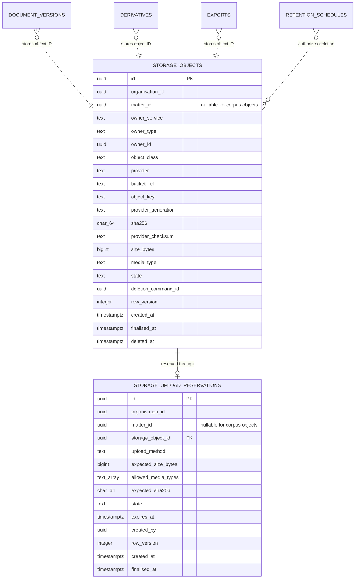

# storage_service — implementation design

Companion to `backend/backend-implementation-plan-v0.md`,
`backend/docs/infrastructure.md`, `document-service.md`,
`retention-service.md`, and `jobs-and-workers.md`.

This service is Draftly's provider-neutral storage control plane. Neon stores
object metadata and workflow state; Google Cloud Storage (GCS), MinIO, or the
local filesystem stores bytes. No application service imports a Google or S3
SDK directly.

## 1. What it owns

`storage_service` owns:

- provider-neutral object references and storage metadata;
- upload reservations and finalisation;
- immutable writes, exact-generation reads, and short-lived signed URLs;
- checksum, size, media-type, and provider-generation verification;
- storage inventory and orphan reconciliation;
- physical deletion after the record-owning service supplies a valid,
  hold-cleared destruction command; and
- startup validation of the selected storage adapter and its non-secret
  configuration.

It does **not** own:

- documents, versions, derivatives, exports, voice captures, or corpus records;
- the decision to retain or destroy a record;
- legal holds, retention schedules, or tombstones;
- organisation or matter authorization;
- database schemas belonging to another service;
- a user's Google Cloud credentials; or
- provider secrets in Neon.

The service owns the bytes and their physical location, not the legal record.
For example, `document_service` owns a `DocumentVersion` and delegates its blob
operations to `storage_service`. `retention_service` decides whether destruction
is allowed; the record-owning service requests the physical delete.

## 2. Where it sits

```text
document / export / voice / corpus application service
                         |
                         v
                 ObjectStoragePort
                         |
                         v
              application/storage_service.py
                  |                 |
                  v                 v
       StorageObjectRepository   BlobStorePort
                  |                 |
                  v                 +-- GcsBlobStore
        Neon/PostgreSQL             +-- S3BlobStore (MinIO)
                                    +-- FilesystemBlobStore
```

There is no public storage API. A browser receives an upload or download grant
only through the owning service after that service re-checks organisation,
matter, capability, and record access. Health endpoints may expose only
`ready | degraded | unavailable`, never bucket names, object keys, account
identifiers, signed URLs, credentials, or connection strings.

The dependency direction remains:

```text
API -> owning application service -> ObjectStoragePort -> storage_service
    -> StorageObjectRepository + BlobStorePort -> provider adapters
```

## 3. Domain models

### StorageObject

```text
StorageObject
  id
  organisationId
  matterId?             # required for matter evidence and matter exports
  ownerService
  ownerType
  ownerId
  objectClass           # original | derivative | export | voice | corpus
  provider              # filesystem | minio | gcs
  bucketRef             # logical bucket alias, not a credential
  objectKey
  providerGeneration?   # required for GCS finalised objects
  sha256
  providerChecksum?     # CRC32C for GCS when available
  sizeBytes
  mediaType
  state                 # reserved | available | quarantined |
                        # pending-deletion | deleted | integrity-failed
  createdAt
  finalisedAt?
  deletedAt?
```

`(provider, bucketRef, objectKey, providerGeneration)` is unique. All rows carry
`organisationId`; matter-scoped rows also carry `matterId`. An object reference
returned to another service uses the Draftly `StorageObject.id`, never a raw
provider URL.

### UploadReservation

```text
UploadReservation
  id
  organisationId
  matterId?
  storageObjectId       # one-to-one reference to the reserved StorageObject
  uploadMethod          # PUT in V0
  expectedSizeBytes
  allowedMediaTypes
  expectedSha256?
  state                 # active | finalised | expired | rejected
  expiresAt
  createdBy
```

A reservation constrains the linked object's exact key, HTTP method, expiry,
size, and media type. Owner and object-class metadata live on the linked
`StorageObject` rather than being copied into both rows. The reservation repeats
the organisation and optional matter scope so every lookup remains tenant- and
matter-scoped without first trusting a join. It cannot be reused for another
organisation, matter, object, or owner.

### DeletionCommand and DeletionReceipt

```text
DeletionCommand
  commandId
  organisationId
  recordScope
  storageObjectIds
  policyId
  policyVersion
  approvedBy
  approvedAt
  holdCheckedAt

DeletionReceipt
  commandId
  deletedObjectIds
  alreadyAbsentObjectIds
  failedObjectIds
  completedAt
```

The command is supplied by the record-owning service after
`retention_service` approval. The storage service re-checks the hold through
`HoldStatusPort` immediately before every destructive provider operation.

### Database schema

This is the proposed Phase 1 relational shape. It is intentionally limited to
the two tables owned by `storage_service` in `contracts/services.yaml`:
`storage_objects` and `storage_upload_reservations`. PostgreSQL stores control
plane metadata only. Object bytes, signed URLs, credentials, and provider
response bodies never enter these tables.



The dotted relationships cross service boundaries and are logical references,
not database foreign keys. For example, `document_versions.storage_object_id`
may point to `storage_objects.id`, but `storage_service` does not query or
mutate the document table. The owning service resolves its own record and then
calls `ObjectStoragePort` with a scoped Draftly storage ID.

#### `storage_objects`

One row represents one immutable provider object throughout reservation,
verification, availability, quarantine, and authorised deletion.

| Column | PostgreSQL shape | Null | Purpose |
| --- | --- | --- | --- |
| `id` | `uuid` primary key | no | Stable Draftly reference returned to owning services. |
| `organisation_id` | `uuid` | no | Tenant boundary used on every lookup and mutation. |
| `matter_id` | `uuid` | yes | Required for matter evidence, matter exports, and voice captures; absent for organisation corpus objects. |
| `owner_service` | `text` | no | Registry service name, such as `document_service` or `export_service`. |
| `owner_type` | `text` | no | Owning aggregate type, such as `document_version` or `export`. |
| `owner_id` | `uuid` | no | Opaque ID from the owning service; intentionally not a cross-service foreign key. |
| `object_class` | constrained `text` | no | `original`, `derivative`, `export`, `voice`, or `corpus`. |
| `provider` | constrained `text` | no | `filesystem`, `minio`, or `gcs`. |
| `bucket_ref` | `text` | no | Logical configured bucket alias, never a credential or URL. |
| `object_key` | `text` | no | Server-built, opaque provider key. |
| `provider_generation` | `text` | yes | Exact provider version; null only before finalisation. Text accommodates GCS generations and S3 version IDs. |
| `sha256` | `char(64)` | yes | Server-verified lowercase SHA-256; null while reserved. |
| `provider_checksum` | `text` | yes | Provider checksum, such as GCS CRC32C, retained as supporting integrity metadata. |
| `size_bytes` | `bigint` | yes | Verified byte count; null while reserved. |
| `media_type` | `text` | yes | Server-verified media type; null while reserved. |
| `state` | constrained `text` | no | `reserved`, `available`, `quarantined`, `pending-deletion`, `deleted`, or `integrity-failed`. |
| `deletion_command_id` | `uuid` | yes | Last authorised destruction command, used for idempotency and receipt reconstruction. |
| `row_version` | `integer` | no | Optimistic concurrency token, starting at `1`. |
| `created_at` | `timestamptz` | no | Reservation or immutable-put creation time. |
| `finalised_at` | `timestamptz` | yes | Time provider metadata and Draftly SHA-256 were verified. |
| `deleted_at` | `timestamptz` | yes | Time deletion of the exact generation was confirmed. |

Recommended constraints and indexes:

- unique `(provider, bucket_ref, object_key, provider_generation)` for an exact
  provider reference;
- unique `(provider, bucket_ref, object_key)` to enforce Draftly's write-once
  key policy, including after logical deletion;
- index `(organisation_id, matter_id, owner_service, owner_type, owner_id)` for
  scoped owner lookups;
- index `(organisation_id, state, created_at)` for reconciliation; and
- checks for non-negative `size_bytes`, a 64-character lowercase hexadecimal
  SHA-256, valid state values, and required finalisation metadata whenever
  `state` is `available`.

Every repository method includes `organisation_id`. Matter-scoped methods also
include `matter_id`; loading by `id` alone is not an allowed repository
operation. Provider generation stays `text` at the domain boundary even when a
specific adapter returns a numeric value.

#### `storage_upload_reservations`

One row represents a single-use, short-lived permission to upload the bytes for
one reserved `storage_objects` row.

| Column | PostgreSQL shape | Null | Purpose |
| --- | --- | --- | --- |
| `id` | `uuid` primary key | no | Reservation ID accepted by finalisation. |
| `organisation_id` | `uuid` | no | Duplicated deliberately so tenancy is enforced without joining first. |
| `matter_id` | `uuid` | yes | Matter scope when the target object is matter-owned. |
| `storage_object_id` | `uuid` foreign key | no | Unique reference to the reserved row in `storage_objects`. |
| `upload_method` | constrained `text` | no | Exact permitted method; initially `PUT`. |
| `expected_size_bytes` | `bigint` | no | Declared exact size, already bounded by the owning service and deployment maximum. |
| `allowed_media_types` | `text[]` | no | Non-empty allowlist used during grant creation and finalisation. |
| `expected_sha256` | `char(64)` | yes | Optional predeclared checksum; finalisation still verifies server-side. |
| `state` | constrained `text` | no | `active`, `finalised`, `expired`, or `rejected`. |
| `expires_at` | `timestamptz` | no | Hard expiry checked before provider access and while finalising. |
| `created_by` | `uuid` | no | Actor ID for audit correlation; not an identity-service foreign key. |
| `row_version` | `integer` | no | Optimistic concurrency token, starting at `1`. |
| `created_at` | `timestamptz` | no | Creation time. |
| `finalised_at` | `timestamptz` | yes | Set in the same transaction that makes the object available. |

Recommended constraints and indexes:

- unique `storage_object_id`, making the reservation-to-object relation
  one-to-one;
- foreign key `storage_object_id -> storage_objects.id` with deletion
  restricted;
- index `(organisation_id, state, expires_at)` for expiry and orphan sweeps;
- checks for positive `expected_size_bytes`, a non-empty media-type allowlist,
  a future expiry at creation, and valid state values; and
- repository validation that reservation and object rows have identical
  `organisation_id` and `matter_id` values before finalisation.

`reserve_upload` creates the `storage_objects` row in `reserved` state and the
linked reservation in one transaction. `finalise_upload` locks both rows,
verifies the exact provider object, changes the object to `available`, and
changes the reservation to `finalised` in one transaction. Expiry changes only
the reservation state; reconciliation decides whether an unfinalised provider
object must be quarantined or removed.

There is no separate deletion-receipt table in the initial schema. The exact
object result is retained on `storage_objects`, the full security event belongs
to `audit_service`, and the legal destruction outcome belongs to
`retention_service` as a tombstone. If retries or partial-failure history later
requires multiple attempts per object, add a registered storage-owned attempt
table through a contract and migration change rather than hiding that history
in JSON.

## 4. Ports

### Port exposed to application services

`ObjectStoragePort` exposes provider-neutral operations:

```text
reserve_upload(scope, owner, constraints) -> UploadGrant
finalise_upload(reservation_id, claimed_sha256) -> StoredObjectRef
put_immutable(scope, owner, stream, metadata) -> StoredObjectRef
put_derivative(scope, owner, stream, metadata) -> StoredObjectRef
open_stream(storage_object_id) -> ByteStream
issue_download_grant(storage_object_id, purpose, ttl) -> DownloadGrant
stat(storage_object_id) -> StoredObjectMetadata
delete_authorised(command) -> DeletionReceipt
```

The owning service performs domain authorization before calling the port. The
storage service independently checks that the requested object scope matches
the authenticated `RequestContext`; defence in depth does not replace the
owner's check.

### Ports used by storage_service

- `StorageObjectRepository` — storage objects and upload reservations in
  PostgreSQL, always organisation-scoped.
- `BlobStorePort` — conditional put, stat, stream, sign, list, and
  generation-matched delete.
- `HoldStatusPort` — authoritative hold check for a record scope. Failure is
  fail-closed.
- `AuditPort` — records reservations, finalisation, grants, integrity failures,
  reconciliation, and deletion without logging content or URLs.
- `ClockPort` and `IdGeneratorPort` — deterministic tests.

`BlobStorePort` is implemented by `GcsBlobStore`, `S3BlobStore`, and
`FilesystemBlobStore`. Provider exceptions are translated to typed storage
errors at this boundary.

## 5. Core methods

### reserve_upload(ctx, scope, owner, constraints) -> UploadGrant

1. Confirm the supplied scope belongs to `ctx.organisationId` and, when
   matter-scoped, `ctx.matterId`.
2. Validate size and media-type constraints before contacting a provider.
3. Build the key from trusted IDs; never accept a client-provided path.
4. Insert an expiring reservation in Neon.
5. Return either a short-lived, exact-key signed upload grant or an API upload
   token, according to the selected adapter.
6. Audit the grant without recording its URL or signature.

### finalise_upload(ctx, reservation_id, claimed_sha256) -> StoredObjectRef

1. Lock the active reservation and reject expired or reused reservations.
2. Read provider metadata for the exact key and generation.
3. Verify size, media type, provider checksum, and the application SHA-256. A
   client claim is never accepted without server-side verification. For a
   direct GCS upload, stream the pinned generation through the verifier when no
   trusted provider SHA-256 exists; GCS CRC32C alone does not replace Draftly's
   evidence SHA-256.
4. For GCS, pin the live object's generation. For MinIO/filesystem, pin the
   adapter's immutable version identifier where available.
5. Mark the storage object `available` and the reservation `finalised` in one
   PostgreSQL transaction.
6. Return the Draftly object reference; never return a permanent provider URL.

If verification fails, mark the object `quarantined` or
`integrity-failed`, deny reads, and enqueue controlled cleanup. Do not silently
replace it.

### put_immutable(ctx, scope, owner, stream, metadata) -> StoredObjectRef

Stream the upload while computing SHA-256. The provider operation must be
conditional on absence. GCS uses `if_generation_match=0`; an existing live
object returns a conflict rather than being overwritten. Persist the returned
generation and checksums. A retry with the same idempotency key returns the
same object only after its metadata matches.

### issue_download_grant(ctx, object_id, purpose, ttl) -> DownloadGrant

Re-check scope and owner authorization, require `state=available`, cap `ttl` at
the configured maximum, bind the grant to `GET` and the exact object generation,
and audit the purpose. Signed URLs are bearer credentials: never log, persist,
cache, email, or include them in events.

### delete_authorised(command) -> DeletionReceipt

1. Lock the target storage rows and validate the command scope.
2. Ask `HoldStatusPort` again. A timeout, error, or active hold refuses deletion.
3. Mark rows `pending-deletion`.
4. Delete the exact provider generation, not merely the current object name.
5. Mark confirmed objects `deleted`, preserving non-content metadata and the
   deletion receipt. Report partial failure explicitly.
6. The record-owning service returns the receipt to `retention_service`; only
   then may retention mark the disposition destroyed.

The method is idempotent on `commandId`. `alreadyAbsent` is not treated as proof
of prior authorized destruction; it triggers reconciliation and audit review.

### collect_orphans(as_of) — scheduled daily

The `storage.collect-orphans` job handles both halves of database/blob drift:

- expired reservations whose provider object exists but has no finalised row;
- finalised rows whose exact provider generation is absent; and
- provider objects under a Draftly-managed prefix that have no storage row and
  are older than 24 hours.

An orphan is deleted only when its trusted key can be mapped to an organisation
and record scope, the grace period has elapsed, and `HoldStatusPort` confirms no
hold. Unknown or malformed keys are quarantined for an operator; they are never
deleted automatically.

## 6. Key layout

The application constructs keys; callers cannot supply them.

```text
{environment}/organisations/{organisation_id}/matters/{matter_id}/
  docs/{doc_id}/v/{version_id}/original
  docs/{doc_id}/v/{version_id}/derivatives/{derivative_kind}/{artifact_id}
  exports/{export_id}/{artifact_id}
  voice/{capture_id}/{artifact_id}

{environment}/organisations/{organisation_id}/corpus/
  sources/{source_id}/v/{version_id}/{artifact_id}
```

IDs are opaque server-generated identifiers. File names, party names, matter
references, email addresses, and document titles never appear in a key. The
logical layout is identical across GCS, MinIO, and filesystem adapters.

## 7. Configuration contract

All settings are typed, validated at startup, and sourced from environment
variables or an approved secret manager. Values shown below are names and safe
defaults, not credentials.

### Shared PostgreSQL/Neon settings

| Setting | Required | Rule |
| --- | --- | --- |
| `DRAFTLY_DATABASE_URL` | yes | Runtime pooled Neon URL; `sslmode=require` and `channel_binding=require` outside local containers |
| `DRAFTLY_DATABASE_MIGRATION_URL` | migration process | Direct, unpooled Neon URL; never exposed to the web process unless that process runs migrations |
| `DRAFTLY_DATABASE_POOL_SIZE` | no | Small bounded application pool; default `5` |
| `DRAFTLY_DATABASE_MAX_OVERFLOW` | no | Default `5`; do not multiply unbounded pools across workers |
| `DRAFTLY_DATABASE_POOL_TIMEOUT_SECONDS` | no | Default `30` |

The storage service uses the same database/session factory as every application
service. It does not create a separate Neon project or manage Neon branches.
Application traffic uses the pooled endpoint; Alembic and administrative tools
use the direct endpoint.

### Shared storage settings

| Setting | Required | Rule |
| --- | --- | --- |
| `DRAFTLY_STORAGE_PROVIDER` | yes | `filesystem`, `minio`, or `gcs`; no silent fallback |
| `DRAFTLY_STORAGE_ENVIRONMENT` | yes | Fixed key prefix such as `local`, `ci`, `preview`, or `staging` |
| `DRAFTLY_STORAGE_DOWNLOAD_TTL_SECONDS` | no | Default `300`, maximum `900` |
| `DRAFTLY_STORAGE_UPLOAD_TTL_SECONDS` | no | Default `900`, maximum `1800` |
| `DRAFTLY_STORAGE_MAX_UPLOAD_BYTES` | yes | Positive deployment limit; owning services may impose a lower limit |
| `DRAFTLY_STORAGE_REAL_DATA_APPROVED` | yes | Default `false`; GCS adapter rejects non-synthetic data while false |

### GCS adapter settings

| Setting | Required for `gcs` | Rule |
| --- | --- | --- |
| `DRAFTLY_GCS_PROJECT_ID` | yes | Expected Google Cloud project ID |
| `DRAFTLY_GCS_BUCKET` | yes | Private, environment-specific bucket |
| `DRAFTLY_GCS_LOCATION` | yes | Must equal the approved residency location |
| `DRAFTLY_GCS_KMS_KEY_NAME` | when CMEK is approved as required | Full CryptoKey resource name; never key material |
| `DRAFTLY_GCS_SIGNING_SERVICE_ACCOUNT` | for signed URLs | Service-account email allowed to sign; not a JSON key |

Use Application Default Credentials. In deployed environments prefer an
attached workload identity or Workload Identity Federation. A service-account
JSON key is not committed, stored in Neon, or placed in a general-purpose
`.env`. `GOOGLE_APPLICATION_CREDENTIALS` is allowed only for controlled local
development when federation is unavailable, and the referenced file remains
outside the repository.

### MinIO and filesystem settings

| Setting | Required | Rule |
| --- | --- | --- |
| `DRAFTLY_MINIO_ENDPOINT` | for `minio` | HTTPS outside a local container network |
| `DRAFTLY_MINIO_BUCKET` | for `minio` | Environment-specific private bucket |
| `DRAFTLY_MINIO_ACCESS_KEY` | for `minio` | Secret |
| `DRAFTLY_MINIO_SECRET_KEY` | for `minio` | Secret |
| `DRAFTLY_FILESYSTEM_ROOT` | for `filesystem` | Absolute path inside an explicitly approved local data directory |

Startup refuses mixed-provider settings, a missing bucket, an unapproved GCS
location, public bucket access, disabled uniform access, a writable filesystem
root outside the configured data directory, or a real-data environment with
`DRAFTLY_STORAGE_REAL_DATA_APPROVED=false`.

## 8. GCS bucket and IAM baseline

Each environment has its own bucket and service identity. The bucket must have:

- public access prevention enforced;
- uniform bucket-level access enabled; object ACLs are never used;
- default Google-managed encryption, or the approved CMEK when required;
- CORS restricted to exact Draftly frontend origins, only required methods and
  headers, and no wildcard origin with credentials;
- Cloud Audit Logs Data Access logging enabled for production/pilot approval;
- object versioning configured as recovery defence, not as permission to
  overwrite originals; and
- lifecycle rules that cannot delete record-scoped objects independently of the
  application retention workflow.

IAM is granted at the bucket, not project-wide:

| Identity | Minimum responsibility |
| --- | --- |
| API runtime | Create constrained signed grants and read metadata; no bucket administration |
| storage worker | Create/read objects and delete exact generations after an authorized command |
| migration/deployment | Validate bucket policy; no routine object-data access |
| human operator | No default object access; time-bound audited elevation for incidents |

Do not grant Editor, Owner, or Storage Admin to the runtime identity. If a
predefined role is broader than the required operations, define and review a
custom role.

## 9. Environment matrix

| Environment | Metadata | Bytes | Data allowed |
| --- | --- | --- | --- |
| Local | Neon dev branch or container PostgreSQL | filesystem or MinIO | synthetic only |
| CI | disposable Neon branch | MinIO service container or filesystem temp root | generated fixtures only |
| Preview | Neon branch per deployment | GCS preview bucket | synthetic only |
| Staging | Neon staging branch | GCS staging bucket | synthetic; approved pilot only after provider gate |
| Production V1 | approved PostgreSQL deployment | approved GCS or self-hosted MinIO deployment | real data only after all infrastructure and legal gates |

Selecting GCS is a deployment setting, not blanket approval for real client
material. Before real matter data reaches Neon or GCS, record the location,
processor terms, subprocessors, retention/deletion behaviour, incident process,
encryption decision, access model, export path, cost, and lawyer approval.

## 10. Transactions and failure handling

PostgreSQL and an object store do not share a transaction. The implementation
uses explicit states and reconciliation:

| Failure | Required result |
| --- | --- |
| Reservation commit fails | No usable grant returned |
| Upload succeeds, finalisation fails | Expiring reservation; orphan sweep after grace period |
| Finalisation commits, owner transaction fails | Available unclaimed object; reconciliation flags it, never immediate deletion |
| Provider stat/checksum fails | Quarantine and retry; never mark available |
| Signed URL creation fails | No persisted partial state; safe retry |
| Delete succeeds, receipt commit fails | Retry exact generation; reconcile provider absence; audit ambiguity |
| Neon unavailable | Fail closed for grants, writes, and deletes; existing signed URLs expire naturally |
| GCS unavailable | Metadata reads may continue; byte reads/writes return a typed retryable error |

No operation converts a provider timeout into success. Retry policy is bounded,
jittered, and idempotent.

## 11. Invariants

| Invariant | How |
| --- | --- |
| Provider-neutral application code | Only `BlobStorePort` adapters import provider SDKs |
| Original bytes never overwritten | Trusted unique key plus conditional create; GCS `if_generation_match=0` |
| Reads resolve the exact object | Draftly ID resolves to bucket, key, and pinned provider generation |
| Every object is tenant-scoped | `organisationId` on every row and organisation prefix on every key |
| Matter evidence cannot cross matters | Scope check in owner and storage facade; non-member existence hidden |
| Signed URLs are short-lived bearer credentials | Exact method/key/generation, capped TTL, never logged or stored |
| Client metadata is untrusted | Server verifies checksum, size, media type, and provider metadata |
| Legal holds win | Destructive paths synchronously re-check `HoldStatusPort` and fail closed |
| Provider lifecycle cannot bypass retention | No autonomous lifecycle deletion for originals or exports |
| Provider secrets never enter Neon or Git | ADC/secret manager only; settings redact secrets |
| Unknown objects are not guessed away | Malformed/unmapped inventory is quarantined for review |
| Deletion is provable and idempotent | Command ID, exact generation, receipt, tombstone flow, and audit |

## 12. Tests

- **Unit:** key construction, scope validation, configuration matrix, TTL caps,
  reservation state transitions, checksum comparison, idempotent deletion, and
  provider-error translation.
- **Contract:** run the same `BlobStorePort` suite against filesystem, MinIO,
  and the GCS emulator/fake; conditional create, exact-generation read/delete,
  signing, stat, list, and retry semantics must match.
- **Integration:** real PostgreSQL plus storage emulator for reservation through
  finalisation; database/provider partial failures; orphan reconciliation;
  missing generation; and deletion receipt recovery.
- **GCS sandbox:** private bucket policy validation, public-access prevention,
  uniform access, least-privilege identity, signed upload/download expiry,
  checksum verification, and `if_generation_match=0` overwrite refusal. Use
  generated fixtures only.
- **Security:** cross-organisation and cross-matter access returns 404; key
  traversal rejected; forged/replayed reservation rejected; signed URL absent
  from logs/events; held object cannot be deleted; runtime cannot administer
  the bucket.
- **Recovery:** inventory rebuild, missing-object detection, exact-generation
  restore verification, and a quarterly database/object-store restore drill.

## 13. Implementation order

1. Add typed settings and startup validation with `filesystem` as the local
   adapter.
2. Add `StorageObject` and `UploadReservation` migrations and repositories.
3. Define `BlobStorePort` and its shared contract suite.
4. Implement filesystem and MinIO adapters for local/CI.
5. Implement `GcsBlobStore` using ADC, conditional operations, checksums, and
   exact-generation references.
6. Route `document_service` through the storage facade without changing its
   document API contract.
7. Move `storage.collect-orphans` ownership to `storage_service` and add the
   hold-aware inventory sweep.
8. Integrate export, voice, and corpus storage one owner at a time.
9. Complete the GCS sandbox and recovery gates before enabling the adapter in
   staging.

## 14. Decisions and approval gates

Selected defaults:

1. **Neon holds metadata only; object bytes never enter PostgreSQL.**
2. **GCS is the managed cloud adapter; filesystem and MinIO remain local/CI and
   self-hosted options.**
3. **Application services depend on `ObjectStoragePort`; provider mechanics
   live behind `BlobStorePort`.**
4. **No public storage endpoints and no permanent object URLs.**
5. **Real-data use remains blocked until the existing residency, processor,
   security, deletion, and lawyer-approval gates are recorded.**

Still requiring explicit approval before real client data:

- exact Neon and GCS regions;
- Google Cloud processor and subprocessor review;
- GCS retention policy, version-recovery window, and CMEK decision;
- whether Production V1 uses approved GCS or self-hosted MinIO; and
- backup destination and cross-region/cross-provider recovery policy.

## References

- [Neon connection pooling](https://neon.com/docs/connect/connection-pooling)
- [GCS request preconditions](https://cloud.google.com/storage/docs/request-preconditions)
- [GCS signed URLs](https://cloud.google.com/storage/docs/access-control/signed-urls)
- [GCS uniform bucket-level access](https://cloud.google.com/storage/docs/uniform-bucket-level-access)
- [GCS public access prevention](https://cloud.google.com/storage/docs/public-access-prevention)
