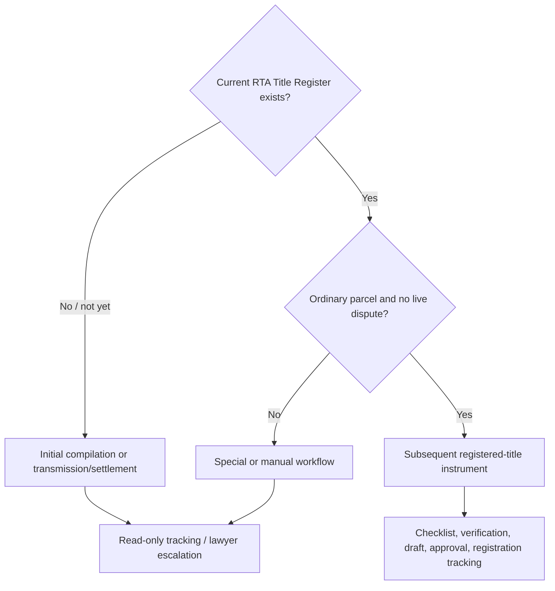
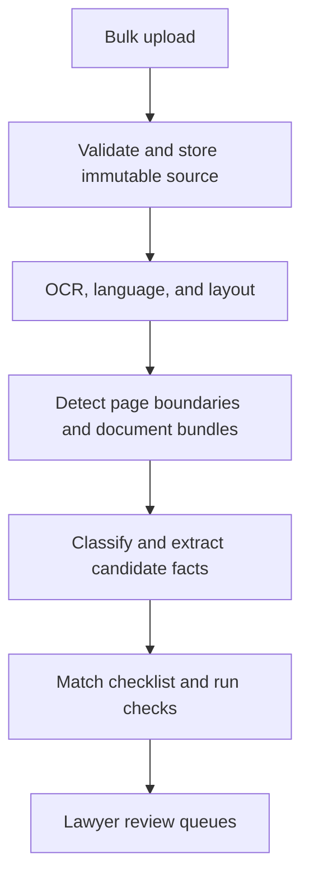
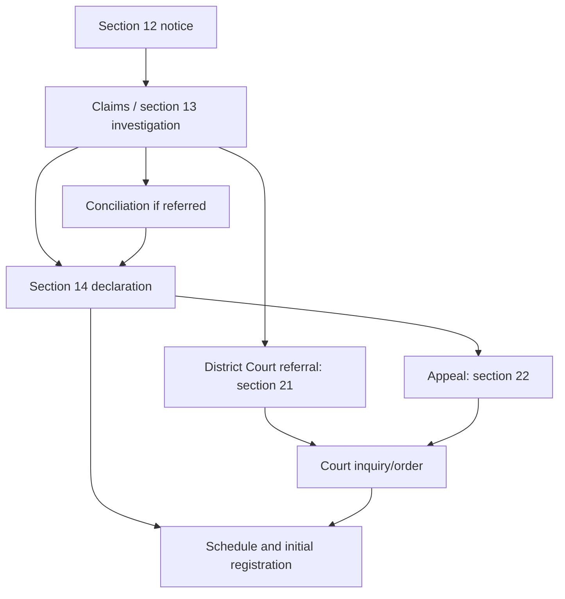
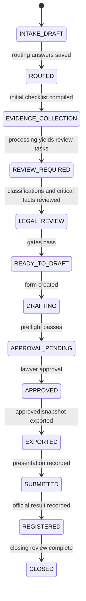

# Draftly RTA Matter Workflow v1

**Status:** Implementation-ready product and legal-workflow specification for lawyer validation
**Version:** 1.0
**Prepared:** 16 August 2026
**Jurisdiction:** Sri Lanka
**Initial legal regime:** Registration of Title Act No. 21 of 1998 (RTA)

> This is a product design, not a substitute for advice from the responsible Sri Lankan notary/conveyancing lawyer. Draftly may organize evidence, test consistency, and prepare drafts. It must not determine ownership, resolve a dispute, attest an instrument, or represent that an instrument is legally effective before registration.

## Executive decisions

1. **The first gate is the title system, not the desired transaction.** Draftly must establish whether the parcel is already registered under the RTA and whether a usable current Title Certificate/Title Register exists. Initial title compilation is a different statutory process from a subsequent transfer, gift, lease, or mortgage.
2. **The 22 Gazette instruments are exact subtypes, not 22 top-level tiles.** The UI should use six understandable transaction families (plus separate statutory-process families), then require selection and lawyer confirmation of the exact prescribed instrument. A controlled `other_declared_instrument` is retained only for an instrument authorized by another law or a genuinely unmapped case.
3. **V0 should be intentionally narrow.** The production pilot should automate (a) an ordinary whole-parcel RTA transfer/sale using Gazette Form 8 and the operational Ti.Re.31 title-certificate application, and (b) a focused cancellation of a registered mortgage using Gazette Form 12. Company, probate/transmission, power-of-attorney, life-interest, co-owner, part-parcel, condominium, active-dispute, and court-sale cases may be triaged and organized but must leave the automated V0 path.
4. **Upload happens early and normally in bulk.** Draftly compiles an initial checklist from a short routing interview, accepts all files together, detects document boundaries page by page, classifies and extracts facts, then asks only unresolved or legally critical questions. Direct upload against a missing checklist item remains available.
5. **Digital receipt and physical-original inspection are separate facts.** No scan, photograph, OCR result, or model confidence may set `physical_original_seen = true`. Only an authorized human can record that event.
6. **Automation never equals legal verification.** High-confidence extraction may auto-organize a document and propose a fact. Critical facts—including owner, party identity, title number, parcel identifiers, extent, encumbrance status, legal capacity, consideration, exact instrument, and form choice—require explicit lawyer confirmation before approval.
7. **Evidence is immutable and traceable.** Every extracted value and every populated form field must link to the exact source file, page, and bounding box. Corrections create new versions and preserve the original model output.
8. **Disputes are a stop condition, not an AI decision branch.** A section 12 notice is not by itself proof of a dispute, and a section 14 declaration is not necessarily final registration. If ownership is contested, a claim/investigation is pending, a section 21 referral or section 22 appeal exists, or a section 29 challenge appears, Draftly shifts to tracking/manual mode and blocks automated drafting.
9. **Local-authority records are contextual evidence, not title.** An assessment-register or “ownership” certificate must never override the RTA Title Register. A name mismatch produces a review warning, not the conclusion that the registered owner lacks title.
10. **Fees and operational instructions are versioned data.** The official RGD fee page is operationally useful but has no populated “Last Modified” date. Draftly must show its verification date and require re-verification rather than permanently hard-code it.
11. **Form namespaces must be explicit.** `rta.reg.2022.form.31` is the Gazette instrument for registration of an address. `rta.ops.tire.31` is the RGD operational application for a new Title Certificate. They are not interchangeable. The same protection is needed for operational Ti.Re.30 versus Gazette Form 30.
12. **The lawyer owns the legal conclusion and final approval.** Generated instruments remain watermarked drafts until an assigned lawyer resolves the approval gates, confirms the template version, and signs a recorded approval declaration.

## 1. Authority model, terminology, and corrections

### 1.1 Source classes

Draftly must show the source class beside every requirement. The classes do not collapse into one generic “required” flag.

| Code | Source class | What it can establish | Examples in this design |
|---|---|---|---|
| `LAW` | Act or other primary legislation | Statutory powers, effects, duties, prohibitions, procedures | RTA ss. 1, 12–14, 21–27, 34–56 |
| `REG` | Regulation/Gazette prescribed under legal authority | Prescribed forms, form content, regulated fees/procedure | Gazette Extraordinary No. 2308/27 of 1 Dec. 2022 |
| `OPS` | Current official agency instruction | How the registry or authority presently accepts/processes a matter | RGD Transactions and Charges pages; UDA approval page |
| `LOCAL_OPS` | Named local-authority instruction | Council-specific certificate, application, validity, and fee practice | Requirements of the relevant municipal/urban/pradeshiya authority |
| `PRACTICE` | Lawyer/notarial risk-control practice | Documents prudent counsel asks for to reach a professional conclusion | Lawyer’s examination-of-title checklist and teaching deck |
| `PRODUCT` | Draftly safety or UX rule | What the software permits, blocks, or requires for auditability | Confidence thresholds, immutable evidence, V0 scope gates |
| `UNVERIFIED` | Assumption or secondary material not yet validated | A question—not a production rule | Old fee, ambiguous translation, or handout-only proposition |

**Precedence rule:** a higher source class does not automatically answer a different question. For example, the Act governs legal effect; the RGD may still specify the operational submission pack; a lawyer may reasonably require additional evidence for professional risk control. Draftly must present the layers separately.

### 1.2 Important corrections from the source pack

- The RTA applies only in areas specified by ministerial Gazette order (RTA s. 1). An address alone does not prove that the parcel is under the RTA.
- Initial compilation produces the first Title Register through cadastral mapping, notice, investigation, determination, and registration (RTA ss. 10–27). It is not one of the 22 subsequent instrument types.
- The four section 14 outcomes are: First Class title under s. 14(a), Second Class title under s. 14(b), a divided portion under s. 14(c), and co-ownership under s. 14(d). A handout that labels Second Class as s. 14(a) is incorrect.
- “Ownership certificate” in a council assessment context records local-authority assessment information. It is not conclusive proof of legal title. Under the RTA, Title Register entries have the statutory effect stated in ss. 32–33, and a Title Certificate has the evidentiary effect in s. 37.
- The local-authority deck’s slide titled “Building line certificate” describes a street-line issue. Street-line and building-line enquiries must remain separate checklist concepts unless the relevant authority issues one combined certificate.
- The deck’s description of an assessment notice as an income-tax notice is inapplicable to the land-rates context and must not be implemented.
- Local-authority certificate names, validity periods, application processes, and fees are jurisdiction-specific and may be combined in one issued certificate. Draftly should model requirements, not assume one uploaded file per requirement.
- The 2014 Gazette introduced/amended a smaller set of forms; the 2022 Gazette amends the regulation and identifies 22 prescribed instrument categories. “22” is therefore the number of listed prescribed instrument categories in the 2022 amendment, not the number of all possible RTA matters, processes, registry services, or documents.
- The RGD operational expedited-service list contains items such as priority notices and instruments under other laws. It is not identical to the Gazette’s 22-form taxonomy.
- The uploaded Sinhala scan labelled Ti.Re.31 is an operational title-certificate application. It is not the Gazette Form 31 instrument for registering an address. Exact translation and field semantics of the scan require Sinhala-speaking lawyer/registry validation before template production.
- The 2022 English form text contains apparent typographical/copy-paste defects (for example, some instrument captions or request sentences do not match the form heading, and “deceased” is rendered as “diseased” in a form title). Draftly must preserve an official source artifact, record a lawyer-approved rendering, and never silently “correct” a legal template.

### 1.3 Core statutory constraints encoded as product gates

| Rule | Product consequence | Source |
|---|---|---|
| RTA applies only to a declared area | `rta_coverage` must be confirmed by the title record/registry evidence before automated drafting | RTA s. 1 |
| Unit of record is the cadastral land parcel | Parcel, block, sheet, cadastral map, and title references are first-class identifiers | RTA ss. 4–5; s. 75 |
| No RTA title/interest is acquired unless registered | Draft output must say “draft”; execution alone is not recorded as completion | RTA s. 38 |
| RTA land must be dealt with under the Act; inconsistent disposition is void | Wrong-regime or wrong-form ambiguity blocks approval | RTA s. 39 |
| Prescribed instrument, parties, two witnesses, and notarial attestation | Form/template, execution, and attestation gates are explicit | RTA s. 43 |
| Notary verifies identity, capacity, parcel, and title | Identity/capacity/title evidence cannot be treated as optional UI decoration | RTA s. 44 |
| Attestor forwards the instrument and relevant Title Certificate within seven working days | Deadline is calculated from attestation and presented as an operational/legal task; late handling requires lawyer action | RTA s. 45(1); current RGD Transactions page |
| Registrar may refuse for form, parcel-description, capacity, or title/interest defects | These four refusal categories anchor preflight checks | RTA s. 45(2) |
| Part of a registered parcel cannot be dealt with before subdivision/new registration | `partial_parcel = true` blocks ordinary transfer drafting and routes to special subdivision workflow | RTA s. 47 |
| Instrument conferring co-ownership is invalid except as provided by the Act | Proposed creation/change of co-ownership is a statutory blocker pending lawyer analysis | RTA s. 48 |
| Instrument takes effect on registration | Matter cannot reach `legally_completed` merely because a form was exported or signed | RTA s. 49 |

## 2. Scope and fundamental distinctions

### 2.1 RTA process map



### 2.2 Process classes and release scope

| Process class | Legal character | Examples | Draftly V0 treatment | Later recommendation |
|---|---|---|---|---|
| Initial title compilation | Government title-settlement process before the first RTA register | s. 12 notice, s. 13 investigation, s. 14 determination, schedule of title, initial registration | Identify, explain, track milestones, store notices/evidence; no ownership decision and no automated instrument | V1 case tracking only; litigation/claim work remains manual |
| Subsequent transaction | Instrument dealing with an already registered title/interest | Sale/transfer, gift, lease, mortgage | Automated only for strict Form 8 transfer/sale eligibility; focused Form 12 cancellation pilot | Add forms in validated waves |
| Administrative/special application | Registry/survey process not equivalent to an ordinary disposition | Address registration, subdivision/amalgamation, condominium, certified extracts, Ti.Re.31 | Ti.Re.31 only as a linked operational form in eligible transfer; otherwise organize/track | Dedicated special workflows after official validation |
| Cancellation/discharge | Removes or cancels a previously registered instrument/interest | Cancellation of mortgage, lease, caveat, life interest, gift, sale agreement | Form 12 focused workflow; others triage/manual | V1 after legal conditions and evidence are validated per type |
| Transmission of title | Title changes because registered owner died or by court/certificate of sale | Testate s. 54, intestate s. 55, court order/certificate s. 56 | Detect and block ordinary transfer until title/authority path is resolved | Guided checklist and tracking; drafting remains lawyer-controlled |
| Title-settlement dispute/court process | Claim, appeal, or court determination affecting ownership/registration | Conciliation, s. 21 referral, s. 22 appeal, s. 29 register challenge | Litigation hold and manual handling | Never automated as an ownership decision |
| Ordinary parcel | One registered cadastral parcel, dealt with as a whole | Simple whole-parcel sale | Eligible if all other V0 gates pass | Core product path |
| Subdivision/amalgamation | Survey and registration restructure the unit of record | Form 7; s. 36 | Special/manual; can compile documents and track | Dedicated V1+ workflow |
| Condominium/strata | Horizontal subdivision under RTA and Apartment Ownership Law | Form 21; ss. 50–52 | Special/manual; no automatic ordinary-title assumptions | Separate product stream after Apartment Ownership Law validation |

### 2.3 V0 eligibility predicate

An automated Form 8 matter is eligible only when every expression below is `true`:

```text
regime == RTA
and current_title_register_confirmed
and current_title_certificate_available_or_registry_verified
and parcel_kind == ORDINARY
and disposition_scope == WHOLE_REGISTERED_PARCEL
and exact_instrument == TRANSFER_SALE
and all transferors_are_current_registered_owners
and parties_are_natural_persons
and no_power_of_attorney
and no_uncompleted_transmission
and no_life_interest_or_special_condition
and no_active_dispute_or_court_notice
and no_unresolved_caveat_seizure_priority_notice_lis_pendens
and no_unresolved_mortgage_or_lease_blocker
and no_proposed_coownership_creation
and template_and_operational_rules_currently_verified
```

The focused Form 12 pilot substitutes `exact_instrument == CANCELLATION_MORTGAGE` and requires an identified registered mortgage, authorized mortgagee/releasor, evidence of discharge, and lawyer confirmation that the selected cancellation route is correct.

Failure of an eligibility predicate does not delete or reject the matter. It changes `automation_scope` to `MANUAL_SUPPORTED`, explains why, preserves the checklist/evidence work, and prevents registration-ready output.

## 3. Canonical matter taxonomy

### 3.1 Hierarchy

```text
Legal regime
  → Matter family
    → Exact instrument subtype or statutory process
      → Conditional scenario modules
```

Recommended stable IDs use lowercase dotted namespaces. Display labels are translatable and may change; IDs never change.

- Regime: `lk.rta`
- Prescribed instrument: `lk.rta.instrument.<name>`
- Statutory process: `lk.rta.process.<name>`
- Registry service: `lk.rta.service.<name>`
- Conditional module: `lk.rta.module.<name>`

### 3.2 Matter families

| Family ID | Lawyer-facing label | Purpose |
|---|---|---|
| `ownership_change` | Transfer ownership | Sale/transfer, gift, exchange, certificate-of-sale registration |
| `agreement_security` | Agreements and security | Sale agreement, security-bond transfer, mortgage |
| `use_interest` | Lease and other interests | Lease, life-interest-holder lease, right of way/access servitude |
| `cancel_release` | Cancel or release an interest | All prescribed cancellations/discharges |
| `notice_admin` | Notices and registry administration | Caveat and address instruments |
| `parcel_structure` | Change parcel/building structure | Subdivision, amalgamation, condominium |
| `title_settlement` | Establish or transmit title | Initial compilation, testate/intestate transmission, court-order registration |
| `dispute_rectification` | Dispute, appeal, or register correction | Conciliation, s. 21/s. 22 matters, s. 29 challenge, rectification/indemnity |
| `controlled_other` | Other legally authorized instrument | Only after lawyer supplies legal basis and template; never a default classification |

### 3.3 All 22 prescribed instruments

“Examination level” below is a Draftly workflow decision, not terminology used by the Act.

| # | Stable subtype ID | User-facing label | Gazette form | Family | Examination level | Release recommendation |
|---:|---|---|---:|---|---|---|
| 1 | `lk.rta.instrument.transfer_sale` | Transfer or sale | 8 | `ownership_change` | Full | **V0 strict pilot** |
| 2 | `lk.rta.instrument.sale_agreement` | Agreement to sell | 23 | `agreement_security` | Focused + encumbrance | V1 |
| 3 | `lk.rta.instrument.security_bond_transfer` | Transfer for a security bond | 24 | `agreement_security` | Full/special security | Deferred pending specialist validation |
| 4 | `lk.rta.instrument.certificate_sale_register` | Register a certificate of sale | 25 | `ownership_change` | Full + court/statutory sale | Deferred/manual |
| 5 | `lk.rta.instrument.sale_agreement_cancel` | Cancel an agreement to sell | 26 | `cancel_release` | Focused cancellation | V1 |
| 6 | `lk.rta.instrument.gift` | Gift | 9 | `ownership_change` | Full + conditions/life interest | V1 |
| 7 | `lk.rta.instrument.gift_cancel` | Cancel a gift | 27 | `cancel_release` | Full/high-risk cancellation | Deferred/manual |
| 8 | `lk.rta.instrument.life_interest_cancel` | Cancel a life interest | 28 | `cancel_release` | Focused + life interest | V1/deferred after validation |
| 9 | `lk.rta.instrument.lease` | Lease | 10 | `use_interest` | Focused title/capacity | V1 |
| 10 | `lk.rta.instrument.lease_cancel` | Cancel a lease | 29 | `cancel_release` | Focused cancellation | V1 |
| 11 | `lk.rta.instrument.mortgage` | Mortgage | 11 | `agreement_security` | Focused title/capacity | V1 |
| 12 | `lk.rta.instrument.mortgage_cancel` | Cancel a mortgage | 12 | `cancel_release` | Focused cancellation | **V0 focused pilot** |
| 13 | `lk.rta.instrument.caveat` | Enter a caveat | 13 | `notice_admin` | Special/grounds review | Deferred/manual |
| 14 | `lk.rta.instrument.caveat_cancel` | Cancel a caveat | 30 | `cancel_release` | Focused/special | Deferred/manual |
| 15 | `lk.rta.instrument.address_register` | Register an address | 31 | `notice_admin` | Minimal identity/title link | V1 after namespace/template validation |
| 16 | `lk.rta.instrument.subdivision_amalgamation` | Subdivide or amalgamate land | 7 | `parcel_structure` | Special survey/cadastral | Deferred dedicated workflow |
| 17 | `lk.rta.instrument.condominium_register` | Register condominium property | 21 | `parcel_structure` | Special strata | Deferred dedicated workflow |
| 18 | `lk.rta.instrument.land_exchange` | Exchange land | 32 | `ownership_change` | Full on both parcels | Deferred/manual |
| 19 | `lk.rta.instrument.life_interest_cancel_death` | Cancel life interest after holder’s death | 33 | `cancel_release` | Focused + death evidence | V1/deferred |
| 20 | `lk.rta.instrument.certificate_sale_cancel` | Cancel registration of certificate of sale | 34 | `cancel_release` | Full + court/statutory sale | Deferred/manual |
| 21 | `lk.rta.instrument.servitude_access_transfer` | Transfer/sell a right of way or access servitude | 35 | `use_interest` | Special servitude | Deferred/manual |
| 22 | `lk.rta.instrument.life_interest_holder_lease` | Lease by a life-interest holder | 36 | `use_interest` | Special life interest/lease | Deferred/manual |

**Legal mapping source:** Gazette Extraordinary No. 2308/27 (2022), amendment to regulation 15(1), items (i)–(xxii), pp. 2A–3A. Every mapping must be stored with the exact Gazette artifact and not merely copied into application code.

### 3.4 Additional RTA processes and services (not part of the 22)

| Stable ID | Label | Legal/operational basis | Automation |
|---|---|---|---|
| `lk.rta.process.initial_compilation` | Initial title compilation | RTA ss. 10–27 | Read-only tracking/manual |
| `lk.rta.process.transmission_testate` | Transmission under a will | RTA s. 54 | Checklist/tracking; manual legal work |
| `lk.rta.process.transmission_intestate` | Transmission on intestacy | RTA s. 55 | Checklist/tracking; manual settlement |
| `lk.rta.process.court_order_owner_register` | Register owner by court order/certificate of sale | RTA s. 56 | Manual/special |
| `lk.rta.process.second_class_challenge` | Challenge Second Class registration | RTA ss. 29–30 | Litigation hold |
| `lk.rta.process.rectification_indemnity` | Rectification/indemnity | RTA ss. 58–62 | Manual/special |
| `lk.rta.service.inspect_title_register` | Inspect Title Register | RTA s. 34; RGD operations | Administrative tracking |
| `lk.rta.service.certified_extract` | Obtain certified extract/copy | RTA s. 35; RGD operations | Administrative tracking |
| `lk.rta.service.new_title_certificate_application` | Apply for new Title Certificate (Ti.Re.31) | Current RGD Transactions page | Linked V0 transfer form |
| `lk.rta.instrument.other_declared_instrument` | Other instrument authorized by law | 2022 regulation allows other enactment formats in suitable cases | Manual only until mapped |

### 3.5 Conditional scenario modules

These are facts about the parties/property, not transaction types:

`company_party`, `estate_or_deceased_owner`, `power_of_attorney`, `coowners`, `mortgage_present`, `lease_or_occupation`, `life_interest`, `servitude`, `building_present`, `local_authority_clearance`, `missing_original`, `active_notice_or_litigation`, `court_or_statutory_sale`, `state_land`, and `special_personal_law`.

The lawyer can add/remove a suggested module, but removal of a rule-triggered module requires a recorded reason. A statutory blocker cannot be removed by relabelling it “not applicable.”

### 3.6 Migration from the current component

| Current `MatterType` | Migration target | Rule |
|---|---|---|
| `transfer` | `lk.rta.instrument.transfer_sale` | Safe direct migration, but mark exact subtype `needs_lawyer_confirmation` |
| `gift` | `lk.rta.instrument.gift` | Direct migration; activate life-interest/conditions screening |
| `lease` | `lk.rta.instrument.lease` | Direct migration unless evidence indicates Form 36 |
| `mortgage` | `lk.rta.instrument.mortgage` | Direct migration unless cancellation/release intent is detected |
| `other` | `lk.rta.instrument.other_declared_instrument` | Never auto-approve; require family, legal basis, and exact instrument selection |

Migration also sets all legacy documents to `classification_status = UNREVIEWED_LEGACY`; it must not preserve the current false assumption that every document’s true type is `other`.

## 4. Intake-question engine

### 4.1 Intake strategy

The intake is deliberately split:

1. **Routing interview (before upload):** seven short questions needed to choose the workflow and immediate stop conditions.
2. **Bulk upload and inference:** Draftly proposes document types and facts.
3. **Resolution interview (after extraction):** only conflicts, missing critical facts, and conditional scenarios are asked.
4. **Pre-draft confirmation:** the lawyer confirms exact instrument, eligibility, critical facts, form version, and unresolved risk disposition.

Answers have four values when appropriate: `YES`, `NO`, `UNKNOWN`, and `NOT_APPLICABLE`. “Unknown” is a valid routing answer and must not be coerced into “No.”

### 4.2 Routing interview

| ID | Exact lawyer-facing question | When/why | Activates | Inference and confirmation |
|---|---|---|---|---|
| `Q01_REGIME` | “Does this parcel already have a Title Certificate/Title Register under the Registration of Title Act?” | First; separates initial settlement from a subsequent transaction | `title_certificate_register`; if no/unknown, `initial_compilation_triage` | Can be inferred from a recognized Title Certificate, but lawyer must confirm before drafting |
| `Q02_INTENT` | “What legal action is the client asking you to take?” | After regime; selects family, then exact subtype | Instrument-specific module | Lawyer must select/confirm; AI may suggest from instructions/documents but cannot finalize |
| `Q03_SCOPE` | “Is the action for the whole registered parcel, part of it, or an undivided interest?” | Immediate s. 47/co-ownership gate | `subdivision_amalgamation`, `coowners` | Infer from draft/plan; mandatory lawyer confirmation |
| `Q04_PARCEL_KIND` | “Is this ordinary land, an existing condominium unit, or a building being converted to condominium title?” | Separates ss. 50–52 special path | `condominium_strata` | Infer from title/unit/plan; mandatory confirmation if condominium indicated |
| `Q05_PARTY_CONTEXT` | “Is any current owner or signing party a company, estate/deceased person, attorney, public body, or other non-individual?” | Early capacity and V0 scope gate | `company_party`, `estate`, `power_of_attorney`, `state_land` | Infer from names/IDs/company/probate docs; lawyer confirms selected party roles |
| `Q06_DISPUTE` | “Do you know of any ownership claim, section 12/14 title-settlement issue, court case, caveat, seizure, priority notice, or lis pendens?” | Prevents unsafe drafting | `caveat_litigation` and possibly `litigation_hold` | Documents can infer indicators; lawyer confirms presence/absence after registry search |
| `Q07_UPLOAD` | “Upload the available matter documents now (all together is recommended).” | Enables inference before long interview | Document ingestion and provisional checklist matching | Not a legal answer; files remain immutable evidence |

Matter reference, client reference, responsible lawyer, office, and language are ordinary case metadata, not legal questions.

### 4.3 Resolution questions

| ID | Question (asked only when triggered) | Trigger and why | Module | Inferable? | Lawyer confirmation |
|---|---|---|---|---|---|
| `Q08_OWNER_DEAD` | “Has a registered or prior owner died, and has title already been transmitted/registered?” | Death evidence, deceased name, probate file, or lawyer answer | `probate_transmission` | Yes, partially | Mandatory; the system cannot infer completed legal transmission solely from probate papers |
| `Q09_PROBATE_PATH` | “Was the estate testate, intestate, or transferred by court order/certificate?” | `Q08 = yes` | `probate_transmission`, `court_sale` | Suggest from probate/order | Mandatory |
| `Q10_MORTGAGE` | “Is any mortgage still registered or apparently uncancelled?” | Mortgage in title/encumbrance/deed history | `mortgage_release` | Yes | Mandatory after current registry evidence |
| `Q11_LEASE_OCCUPATION` | “Is anyone in possession under a lease, tenancy, licence, or other occupation?” | Lease or third-party address/utility/occupation evidence | `lease_occupation` | Partial only | Mandatory; silence in uploaded papers is not proof of no occupation |
| `Q12_LIFE_INTEREST` | “Is a life interest registered, reserved, proposed, or being cancelled?” | Life-interest wording/field or relevant subtype | `life_interest` | Yes | Mandatory |
| `Q13_SERVITUDE` | “Does the matter create, transfer, depend on, or alter a right of way/access servitude?” | Plan/title/instrument mentions access | `servitude_right_of_way` | Yes | Mandatory for legal characterization |
| `Q14_ENCUMBRANCE` | “Are there any other current caveats, seizures, agreements, priority notices, injunctions, or pending proceedings?” | Registry/encumbrance evidence or Q06 | `encumbrance`, `caveat_litigation` | Yes, from evidence | Mandatory after search; cannot infer absence from missing documents |
| `Q15_BUILDING` | “Is there an existing building included in the transaction?” | Plan, address, valuation, C of C, or lawyer answer | `building_compliance` | Usually | Confirmation needed when it changes checklist or client advice |
| `Q16_APPROVALS` | “If there is a building, are an approved building plan and Certificate of Conformity available or required for this matter?” | Q15 yes | `building_compliance` | Document presence yes; legal applicability no | Lawyer confirms applicability for jurisdiction/matter |
| `Q17_LOCAL_AUTHORITY` | “Which local authority has jurisdiction, and which certificates/searches does your office require?” | Transfer/gift or local documents | `local_authority` | Jurisdiction may be inferred from address | Lawyer confirms authority and office practice |
| `Q18_ORIGINALS` | “Which required physical originals have you personally inspected?” | After digital organization | Any item needing original | No—never inferred | Human attestation required per item with date and reviewer |
| `Q19_MISSING_ORIGINAL` | “Is any expected original unavailable, and what substitute/curative action has been approved?” | Expected original absent or copy-only | `missing_original` | Absence can be detected, reason cannot | Mandatory lawyer disposition |
| `Q20_COOWNERS` | “Are there multiple registered owners, and will the proposed instrument create or alter co-ownership?” | Multiple owners/shares | `coowners` | Yes | Mandatory because of RTA s. 48 and RGD separate-instrument guidance |
| `Q21_COMPANY_AUTH` | “Which officers are authorized, and what current company resolution/constitutional evidence supports execution?” | Company party | `company_authority` | Suggest from documents | Mandatory |
| `Q22_POA` | “Does the Power of Attorney expressly authorize this transaction and identify the land as required?” | Attorney execution | `power_of_attorney` | Extract language | Mandatory legal conclusion |
| `Q23_SEARCH_CUTOFF` | “What is the date/time of the latest Title Register/encumbrance search, and is a refresh required before execution?” | Search evidence present | `registry_search` | Yes | Lawyer confirms acceptable currency |
| `Q24_CONSIDERATION` | “Confirm the consideration/value, stamp-duty basis, and payment evidence.” | Any monetary form | `stamp_registration` | Extract from instructions/receipt | Mandatory |
| `Q25_DEADLINE` | “Has the instrument already been attested? If yes, when?” | Draft/executed instrument detected | Registration deadline | Yes | Mandatory; drives seven-working-day task |

### 4.4 Question suppression and re-opening rules

- Do not ask a noncritical fact if one high-confidence document source provides it and no source conflicts; show it later in the verification queue.
- Ask immediately when a fact controls regime, exact instrument, V0 eligibility, statutory prohibition, or dispute hold.
- A suppressed question automatically re-opens if a later file conflicts, the source is superseded, or the document classification is rejected.
- “No document found” never auto-answers a negative legal fact. It creates `UNKNOWN` plus a missing-evidence task.
- The responsible lawyer can answer manually before upload. A later conflicting extraction creates a review task; it does not silently replace the answer.

## 5. Checklist compiler

### 5.1 Compilation model

```text
Base matter administration
+ regime and title-status module
+ exact-instrument module
+ condition-triggered scenario modules
+ jurisdiction/office policy modules
+ matter-specific lawyer additions
= versioned matter checklist
```

The compiler produces a **snapshot** with the rule-set version and source citations used. When an intake answer or confirmed fact changes, Draftly previews the checklist delta (“3 added, 1 no longer applicable”) and creates a new snapshot. It never silently removes a previously reviewed requirement.

Each rule has:

- a stable `requirement_definition_id`;
- a human label and explanation;
- a condition expression over confirmed/provisional facts;
- source records separated by `LAW`, `REG`, `OPS`, `LOCAL_OPS`, `PRACTICE`, and `PRODUCT`;
- `mandatory_basis` (`LEGAL`, `OPERATIONAL`, `LAWYER_POLICY`, `PRODUCT_SAFETY`, or `CONDITIONAL`);
- acceptable document classes and whether one document may satisfy several requirements;
- freshness/original/verification policy;
- blocker behavior; and
- effective and superseded versions.

### 5.2 Standard module catalogue

| Module ID | Label | Representative requirements | Primary basis |
|---|---|---|---|
| `C00_MATTER_ADMIN` | Matter administration | Matter/client reference, responsible lawyer, language, conflict-check marker, authority/jurisdiction | Product/office policy |
| `C01_IDENTITY_CAPACITY` | Identity and capacity | Certified ID for parties; roles; witness details at execution; age/capacity; representative authority | RTA ss. 43–45; RGD operations |
| `C02_RTA_TITLE` | Title Certificate and Title Register | Current Title Certificate, title class, registered owner/interest holder, Title Register reference, title number | RTA ss. 32–37, 44–45; RGD operations |
| `C03_REGISTRY_SEARCH` | Current registry search | Inspection/search request, certified extract, search date/time, relevant instruments/copies | RTA ss. 34–35; prudent practice; RGD services |
| `C04_SURVEY_CADASTRAL` | Survey and cadastral identity | Approved/current plan as relevant, cadastral map, district/DSD/GN/village, map/block/sheet/parcel, extent/boundaries/access | RTA ss. 4, 10–11, 36, 44; practice |
| `C05_TITLE_HISTORY` | Deeds and title history | Prior deeds/instruments needed to explain legacy entries or resolve a discrepancy; chain table | Practice; not a universal substitute for the RTA register |
| `C06_ENCUMBRANCES` | Encumbrances and interests | Mortgages, leases, sale agreements, caveats, seizures, priority notices, injunctions/lis pendens, servitudes | RTA s. 44; Title Register/form content; practice |
| `C07_MORTGAGE_RELEASE` | Mortgage and release | Registered mortgage instrument/reference, mortgagee identity/authority, payment/discharge evidence, cancelled bond or release, registration of cancellation | Form 11/12; RTA ss. 43–45; practice |
| `C08_LEASE_OCCUPATION` | Lease and occupation | Lease instrument/term/rent/conditions, cancellation, possession/occupants, vacant-possession instruction | Form 10/29/36; practice |
| `C09_PROBATE_TRANSMISSION` | Probate and transmission | Death certificate; will/probate/instrument or intestate notice/settlement; estate inventory/distribution evidence as applicable; final registered transmission | RTA ss. 54–55; practice |
| `C10_COMPANY_AUTHORITY` | Company authority | Current incorporation/registry evidence, constitutional authority where relevant, current directors/officers, board/company resolution, signing authority/seal practice | Company-law/lawyer validation required; practice checklist |
| `C11_LOCAL_AUTHORITY` | Local-authority records | Jurisdiction-specific street line, building line, non-vesting, assessment/“ownership,” assessment notice, rates/tax receipts | Local operations and lawyer practice; not title |
| `C12_BUILDING_COMPLIANCE` | Building compliance | Approved building plan, development permit where applicable, Certificate of Conformity, discrepancies/alterations | UDA/local operations and lawyer practice |
| `C13_SUBDIVISION_AMALGAMATION` | Subdivision/amalgamation | Owner application/declaration, all encumbrances/orders, Title Register and cadastral references, authorized surveyor’s proposed plan, Survey Department certification, cancellation of valid sale agreements | RTA s. 36; Form 7; RGD operations |
| `C14_CONDOMINIUM_STRATA` | Condominium/strata | Parent title, prescribed application, condominium plan, survey certification, Apartment Ownership Law documents/declarations, unit/common-property mapping | RTA ss. 50–52; Form 21; RGD operations; other law |
| `C15_LIFE_INTEREST` | Life interest | Holder/owner identities, registration reference, permitted conditions, consent/cancellation/death evidence, effect on lease/gift | Forms 9, 28, 33, 36; RTA s. 46 |
| `C16_SERVITUDE_ACCESS` | Servitude/right of way | Dominant/servient parcel identifiers, registered right, plan/access depiction, transfer terms and affected parties | RTA s. 75; Form 35; lawyer validation |
| `C17_CAVEAT_LITIGATION` | Caveats, notices, and litigation | Caveat/notice, claimant, registered date/day-book reference, seizure/injunction/lis pendens, pleadings/orders, title-settlement stage | Forms 13/30; RTA ss. 7–9, 21–25, 29–30; practice |
| `C18_CANCELLATION_RELEASE` | Cancellation/discharge | Exact prior instrument and registration, eligible canceling parties, statutory/contractual ground, consent/order/death evidence, effective cancellation wording | Relevant cancellation form and underlying law |
| `C19_COURT_STATUTORY_SALE` | Court/statutory sale | Court/authority, order and decree, certificate of sale, finality/authority, purchaser, cancellation/registration evidence | RTA ss. 24–25, 56; Forms 25/34 |
| `C20_STAMP_REGISTRATION` | Stamp and registration | Consideration, stamp-duty basis/receipt as applicable, registration fee, duplicate/photo rule, attestation date, seven-working-day task, presentation/day book, result/new or endorsed Title Certificate | RTA ss. 40–45; RGD operations |
| `C21_POWER_OF_ATTORNEY` | Power of Attorney | Registered/current POA, principal/attorney IDs, express transaction capacity, land description, revocation check | RGD operations; underlying law/lawyer validation |
| `C22_COOWNERS` | Co-owner handling | Current shares/rights, separate-instrument requirement, no prohibited creation of co-ownership, all necessary parties | RTA ss. 14(d), 48; current RGD operations |

### 5.3 Typical item-level requirements and their authority

| Checklist item | Default applicability | Source characterization | What Draftly may safely conclude |
|---|---|---|---|
| Prescribed instrument in the applicable form | Every mapped transaction | `REG`, high confidence | Whether the selected template matches the mapped form; lawyer confirms legal fit and completed wording |
| Current Title Certificate | Subsequent transactions unless an expressly validated exception applies | RTA ss. 44–45 and `OPS`, high confidence | Presence and extracted identifiers—not authenticity/current legal status by scan alone |
| Current/certified Title Register extract | Full examinations and when currency/encumbrances matter | RTA ss. 34–35 plus `PRACTICE`, high confidence as an available service; applicability is lawyer policy | Search date, entries, and mismatches; not a guarantee that no later entry exists |
| Certified party identification | Registry submission pack | Current RGD `OPS`, high confidence but versioned | Data match/presence; not that the person physically appeared |
| Original stamp-duty receipt | Where stamp duty applies | Current RGD `OPS`, high confidence but transaction/tax treatment needs current validation | Receipt details and internal consistency; not tax-law sufficiency |
| Approved survey plan/cadastral map | Full examination by office practice; legally specific for subdivision | `PRACTICE` generally; RTA s. 36 for subdivision | Identifier/extent comparison; approval/authenticity requires human/official evidence |
| Encumbrance and registered-instrument copies | When an entry or risk is present | RTA title verification duties/form fields plus `PRACTICE` | Detect disclosed entries; no absence conclusion without current search |
| Probate suite | Only when death/transmission/history makes it relevant | RTA ss. 54–55 plus `PRACTICE` | Document/fact consistency; never that succession is legally complete unless current registration confirms it |
| Company documents/resolution | Company party | `PRACTICE`; company-law requirements outside supplied RTA sources | Authority indicators; legal sufficiency requires lawyer confirmation |
| Street/building line, non-vesting, assessment/rates records | Jurisdiction and lawyer-policy dependent | `LOCAL_OPS`/`PRACTICE`, medium until authority-specific rule is verified | Regulatory/payment/assessment facts; never RTA ownership |
| Approved building plan/Certificate of Conformity | Building and matter-purpose dependent | UDA/local `OPS` and `PRACTICE`, medium until jurisdiction verified | Presence, issue details, and consistency; not conclusive legality of all construction |
| Utility bills | Only when the lawyer uses them for address/occupation corroboration | `PRACTICE`, low-to-medium | Address/account/occupation clue; never legal ownership |
| Physical original inspected | Only where office/lawyer rule requires | Human review event | Only the named reviewer’s recorded inspection; never model-inferred |

### 5.4 Checklist status model

A single enum such as `verified` or `missing` loses critical distinctions. Store the following orthogonal dimensions:

```ts
type ApplicabilityStatus =
  | "PROVISIONAL_REQUIRED"
  | "REQUIRED"
  | "CONDITIONAL"
  | "NOT_APPLICABLE"
  | "WAIVED_BY_LAWYER";

type CollectionStatus =
  | "NOT_REQUESTED"
  | "REQUESTED"
  | "MISSING"
  | "PARTIAL"
  | "RECEIVED";

type DigitalReviewStatus =
  | "UNREVIEWED"
  | "AI_ORGANIZED"
  | "LAWYER_CONFIRMED"
  | "REJECTED"
  | "SUPERSEDED";

type PhysicalOriginalStatus =
  | "NOT_REQUIRED"
  | "UNKNOWN"
  | "COPY_ONLY"
  | "ORIGINAL_REPORTED"
  | "ORIGINAL_INSPECTED";

type CurrencyStatus =
  | "NOT_APPLICABLE"
  | "UNKNOWN"
  | "CURRENT"
  | "STALE"
  | "EXPIRED";

type ConsistencyStatus =
  | "NOT_CHECKED"
  | "MATCHED"
  | "MISMATCH"
  | "INCONCLUSIVE";

type ResolutionStatus =
  | "OPEN"
  | "ACTION_REQUESTED"
  | "SATISFIED"
  | "EXCEPTION_ACCEPTED"
  | "REMEDIATED"
  | "CLOSED";
```

Rules:

- `ORIGINAL_INSPECTED` requires reviewer ID, timestamp, inspection method/location, and an immutable audit event.
- `WAIVED_BY_LAWYER` requires reason and source/basis; it cannot waive a statutory prohibition or turn absent evidence into a fact.
- `SATISFIED` is computed from the requirement policy and all dimensions. It is not a free-form button.
- A combined local-authority certificate may link to several checklist items. Each link has its own satisfaction decision.
- An item can be `RECEIVED`, `LAWYER_CONFIRMED`, and still `MISMATCH` or `EXPIRED`.
- Replacing a document sets the earlier satisfaction link to `SUPERSEDED`; it does not delete history.

### 5.5 Registration-pack shorthand used in the matrix

- **`RP-BASE`**: prescribed form; owner’s Title Certificate; relevant certified party IDs; stamp-duty receipt when applicable; registration fee/submission details. This is based on the current official RGD Transactions page and must be versioned.
- **`RP-DUP`**: duplicate instrument and photograph rule currently stated by RGD for sale/transfer, gift, and exchange.
- **`RP-TC`**: operational Ti.Re.31 application for a new Title Certificate in a transfer matter. This is not Gazette Form 31.
- **`RP-PLAN`**: hard-copy surveyor’s plan/special survey material for subdivision/amalgamation as operationally required.
- **`RP-CONDO`**: condominium declaration/deed, condominium plan, and other conversion material described by current RGD operations, plus documents required by the Apartment Ownership Law after validation.

These packs are configurable operational rules, not new legal instruments.

### 5.6 Practical requirement matrix for all 22 instruments

`H` means high confidence in the mapping/source proposition. `M` means the exact matter applicability or current local/operational practice still needs lawyer confirmation.

| Exact subtype | Registration pack | Default examination/checklist modules | Source class and confidence |
|---|---|---|---|
| Transfer or sale (F8) | `RP-BASE + RP-DUP + RP-TC` | `C01–C06, C20`; conditional `C07–C12, C15–C17, C21–C22` | Form: `REG-H`; RGD pack: `OPS-H` content/`M` currency; full exam: `PRACTICE-M` |
| Sale agreement (F23) | `RP-BASE` | `C01–C04, C06, C20`; later-disposition risks | `REG-H`, `OPS-H/M`, `PRACTICE-M` |
| Security-bond transfer (F24) | `RP-BASE` | `C01–C07, C20`; security terms/authority specialist review | `REG-H`; special legal applicability `M` pending validation |
| Register certificate of sale (F25) | `RP-BASE` and certificate/order material | `C01–C06, C19–C20` | `REG-H`; court/statutory evidence applicability `LAW/REG-H`, workflow `M` |
| Cancel sale agreement (F26) | `RP-BASE` | `C01–C03, C06, C18, C20`; identify exact registered agreement | `REG-H`, `OPS-H/M` |
| Gift (F9) | `RP-BASE + RP-DUP` | `C01–C06, C15, C20`; conditional donor conditions, company/probate | `REG-H`, `OPS-H/M`, full exam `PRACTICE-M` |
| Cancel gift (F27) | Validated cancellation pack; original Title Certificate exception must be handled | `C01–C06, C15, C18, C20`; grounds and notice high-risk review | `REG-H`; legal sufficiency requires specialist confirmation |
| Cancel life interest (F28) | `RP-BASE` | `C01–C03, C15, C18, C20` | `REG-H`, workflow `M` |
| Lease (F10) | `RP-BASE` | `C01–C04, C06, C08, C20`; occupation and term | `REG-H`, `OPS-H/M`, practice `M` |
| Cancel lease (F29) | `RP-BASE` | `C01–C03, C08, C18, C20` | `REG-H`, `OPS-H/M` |
| Mortgage (F11) | `RP-BASE` | `C01–C04, C06–C07, C20`; lender/borrower authority and terms | `REG-H`, `OPS-H/M`, practice `M` |
| Cancel mortgage (F12) | `RP-BASE`; prior mortgage and discharge/release evidence | `C01–C03, C07, C18, C20` | `REG-H`, `OPS-H/M`, curative evidence `PRACTICE-M` |
| Caveat (F13) | Prescribed caveat pack | `C01–C03, C17, C20`; claimant interest/grounds manual review | `REG-H`; legal grounds/process needs lawyer validation |
| Cancel caveat (F30) | `RP-BASE`; exact caveat reference | `C01–C03, C17–C18, C20` | `REG-H`; workflow `M` |
| Register address (F31) | `RP-BASE` as applicable | `C01–C03, C20`; proof of address per validated office rule | `REG-H`; operational document pack `M` |
| Subdivision/amalgamation (F7) | `RP-BASE + RP-PLAN` | `C01–C04, C06, C13, C17, C20`; cancel valid sale agreements | RTA s. 36/`REG-H`; RGD `OPS-H/M`; survey workflow `M` |
| Register condominium (F21) | `RP-BASE + RP-CONDO` | `C01–C04, C06, C14, C20`; parent/unit/common property | RTA ss. 50–52/`REG-H`; other-law details require validation |
| Exchange land (F32) | `RP-BASE + RP-DUP` for both sides | `C01–C06, C20` duplicated/cross-linked for each parcel; all conditional modules | `REG-H`, `OPS-H/M`, full exam `PRACTICE-M` |
| Cancel life interest after death (F33) | `RP-BASE`; certified death evidence | `C01–C03, C09, C15, C18, C20` | `REG-H`; death attachment shown in form; workflow `M` |
| Cancel certificate of sale (F34) | `RP-BASE`; prior certificate/order/cancellation authority | `C01–C06, C18–C20` | `REG-H`; specialist legal sufficiency `M` |
| Transfer right of way/access servitude (F35) | `RP-BASE`; affected title/plan material | `C01–C04, C06, C16, C20`; dominant/servient parcels | `REG-H`; servitude analysis `M` |
| Lease by life-interest holder (F36) | `RP-BASE` | `C01–C04, C06, C08, C15, C20`; scope/duration/consents | `REG-H`; legal applicability `M` |

The matrix intentionally does **not** assert that the lawyer’s full title checklist is legally mandatory for every one of the 22 forms. It is a professional examination framework whose modules are selected by the instrument and the facts.

### 5.7 Matter-specific lawyer additions

The responsible lawyer may add an item such as “obtain institutional deed of release for legacy mortgage” with:

- label and explanation;
- requested document/evidence class;
- whether it is a blocker;
- responsible person and due date;
- source as `LAWYER_INSTRUCTION`/`PRACTICE`;
- links to the issue and prior instrument; and
- a completion decision.

Private names, identity numbers, deed numbers, and addresses from the supplied sample checklist/decks must not be copied into product templates, demonstrations, analytics, or training corpora. Examples in this specification are deliberately anonymized.

## 6. Document ingestion and organization

### 6.1 Lawyer experience and processing pipeline



The upload screen accepts PDF, PDF/A, common image formats, and—after a secure conversion service is implemented—office documents. Files are uploaded using resumable, checksummed sessions. The client shows progress but the server is authoritative.

### 6.2 Safe ingestion stages

1. **Quarantine:** record tenant/matter/uploader; calculate SHA-256; validate MIME by content; enforce page/size limits; malware scan; reject password-protected or unsupported files with a recoverable reason.
2. **Immutable storage:** preserve original bytes, filename, timestamps, hash, and encryption metadata. Never rewrite the source to “fix” rotation/OCR.
3. **Page normalization:** create derivative page images/PDF for processing; detect rotation, skew, blank pages, and image quality. Derivatives link to the source hash.
4. **Language/layout extraction:** detect Sinhala, Tamil, English, and mixed-script regions per page; retain OCR engine/version, text spans, bounding boxes, and confidence. Printed text, handwriting, stamps, signatures, seals, photographs, and tables are separate region types.
5. **Boundary detection:** propose page ranges representing documents. Headers, form numbers, page numbering, parties, title/parcel references, visual continuity, and blank separators are signals.
6. **Cross-file bundling:** propose that fragments across files form one logical document; never merge source bytes. A `DocumentBundle` relates fragments in order.
7. **Classification:** predict controlled document class, subtype, language, issuer, execution/issue date, and version. `UNIDENTIFIED` is a first-class result.
8. **Fact extraction:** create evidence-linked candidate facts; do not write directly to the canonical matter record.
9. **Checklist matching:** create many-to-many satisfaction proposals. One combined authority certificate may satisfy several items; one item may require several documents.
10. **Checks and queues:** run deterministic comparisons, then send low-confidence boundaries/classes, critical facts, and conflicts to the lawyer.

### 6.3 Complex file situations

| Situation | Required behavior |
|---|---|
| Several documents in one PDF | Create separate `DetectedDocument` page ranges. Show split preview and permit lawyer correction without altering source pages. |
| One document split over files | Create a logical `DocumentBundle` with ordered fragments. Preserve every source and page reference. |
| Duplicate upload | Detect exact hash and probable visual/content duplicate. Mark relationship `EXACT_DUPLICATE` or `POSSIBLE_VERSION`; do not delete automatically. |
| Newer version | Ask lawyer which is current; mark older document `SUPERSEDED` but keep all facts/check results and audit history. |
| Combined certificate | Permit one document to link to multiple checklist items, with independent reviewer decisions. |
| Unidentified item | Keep in Document Inbox, extract only safe generic metadata, and ask for classification. Do not discard it or label it `other` permanently. |
| Handwriting/stamp/signature | Detect presence/location and transcribe only above threshold. Never claim authenticity or that a signature is valid. |
| Missing pages | Detect numbering/continuity anomaly and create `DOCUMENT_INCOMPLETE`; do not invent content. |
| Poor scan | Request a clearer copy while preserving the original. Critical low-quality fields remain unresolved. |

### 6.4 Confidence and automation policy

Model confidence is calibrated per document class, language, and field—not treated as a universal probability.

| Decision | Auto-organize threshold | Review behavior |
|---|---:|---|
| Page boundary | `>= 0.97` and no continuity anomaly | May create a provisional split; 0.80–0.969 goes to boundary review; below 0.80 remains unsplit/unidentified |
| Document class | `>= 0.95` and top-two margin `>= 0.15` | Auto-file as `AI_ORGANIZED`, never lawyer-confirmed; 0.80–0.949 confirm queue; below 0.80 unidentified |
| Noncritical fact | `>= 0.95`, clean OCR, and no conflict | Show as candidate and permit checklist matching; 0.80–0.949 review; below 0.80 unresolved |
| Critical legal/form fact | No confidence bypass | Always requires lawyer confirmation, even at 1.00 model confidence |
| Negative fact (“no mortgage”) | Never inferred from document absence | Requires current search evidence plus lawyer conclusion |
| Physical original/authenticity | Never automated | Human-only event/conclusion |

Critical facts include exact legal regime/instrument, current owner, party/role, NIC/passport number, capacity/authority, title number/class, cadastral map/block/sheet/parcel, extent, whole/part scope, consideration, life interest, encumbrance status, court/dispute status, attestation date, and every fact used to select or legally complete a form.

### 6.5 Lawyer corrections

- “Change document type,” “move/split pages,” “join fragments,” and “correct fact” create review decisions with old value, new value, reason, reviewer, timestamp, and evidence.
- Corrections never overwrite the OCR/model event.
- Corrected examples remain tenant data and are not reused for model training unless a separate, explicit, legally reviewed consent and de-identification program exists.
- Reprocessing with a new OCR/model version creates a new extraction run. It cannot silently mutate an approved matter.

## 7. Verification and red-flag engine

### 7.1 Check architecture

Checks consume versioned facts and evidence. Each result records:

`check_definition_version`, input fact versions, evidence, outcome (`PASS`, `FAIL`, `INCONCLUSIVE`, `NOT_RUN`), severity, explanation, suggested action, legal/source basis, and whether a human conclusion is required.

A “pass” means only that the encoded comparison passed. It is not a title opinion.

### 7.2 Core cross-document checks

| Check ID | Comparison | Default outcome/severity on failure | Safety rule/action |
|---|---|---|---|
| `CHK_PARTY_IDENTITY` | Party names, aliases, ID numbers, addresses, photographs across IDs/forms/authority docs | `HIGH_RISK` or `BLOCKING` for ID-number/role conflict | Require lawyer resolution; allow alias explanation, never silently normalize a different person |
| `CHK_OWNER_TRANSFEROR` | Current registered owner/interest holder vs proposed transferor/lessor/mortgagor | `BLOCKING` | Resolve transmission/authority or wrong party before drafting |
| `CHK_TITLE_REFERENCE` | Title number, registry, title class across Title Certificate, extract, form | `BLOCKING` | Correct source/form or obtain current official record |
| `CHK_PARCEL_ID` | District/DSD/GN/village, cadastral map, block, sheet, parcel | `BLOCKING` for core ID conflict | Side-by-side evidence; no fuzzy auto-acceptance |
| `CHK_EXTENT` | Extent and units across register, certificate, plan, instrument | `HIGH_RISK`; `BLOCKING` if form cannot accurately describe parcel | Convert units transparently; lawyer confirms tolerances/curative action |
| `CHK_PLAN_DETAILS` | Plan number/date/surveyor/lot/boundaries/access | `HIGH_RISK` | Survey/legal review; do not declare a boundary defect automatically |
| `CHK_WHOLE_PART` | Proposed scope vs registered parcel | `BLOCKING` if part without completed subdivision | RTA s. 47 special path |
| `CHK_COOWNERSHIP` | Existing owners/shares and proposed effect | `BLOCKING` if prohibited instrument would confer co-ownership | RTA s. 48; lawyer decides valid structure |
| `CHK_INSTRUMENT_CONDITIONS` | Proposed sale/gift conditions and life-interest wording | `BLOCKING` when inconsistent with validated operational/legal rule | Current RGD guidance states no condition/life interest in a sale and no gift condition other than transfer of a life interest; lawyer/template counsel must confirm production rule |
| `CHK_DEED_INSTRUMENT_REF` | Prior instrument number/date/notary/day-book/title-register references | `HIGH_RISK` | Obtain/correct certified instrument or lawyer explanation |
| `CHK_MORTGAGE_STATUS` | Mortgage entry vs cancellation/release/certified current register | `HIGH_RISK`; blocks approval of an unqualified transfer while unresolved | Obtain cancelled bond/deed of release or complete Form 12/registry action; lawyer confirms effect |
| `CHK_LEASE_STATUS` | Registered lease term/cancellation and possession | `HIGH_RISK` if current; warning if status unclear | Confirm client instruction/occupancy and legal effect |
| `CHK_CAVEAT_LITIGATION` | Caveat, seizure, priority notice, lis pendens/injunction, s. 29 notice, court pleadings | `BLOCKING` when active/ownership-affecting; otherwise `HIGH_RISK` | Litigation/manual route; AI never decides merits |
| `CHK_PROBATE_AUTHORITY` | Deceased owner, will/probate/letters, inventory/distribution, executor/administrator, final registered transmission | `BLOCKING` if signer/title authority unresolved | Follow s. 54/s. 55 path and lawyer conclusion |
| `CHK_COMPANY_AUTHORITY` | Company identity/status, current officers, constitution and resolution/signing authority | `BLOCKING` if authority unresolved | Current official company evidence and lawyer confirmation required |
| `CHK_ASSESSMENT_NAME` | Council assessment-register name vs current title owner | `WARNING` | Review/update council record; never infer lack of title from mismatch |
| `CHK_RATES_CURRENCY` | Assessment period, receipts, balances, non-vesting statement | `WARNING` or office-policy `HIGH_RISK` | Jurisdiction-specific; no automatic title conclusion |
| `CHK_BUILDING_COMPLIANCE` | Approved plan/development permit vs Certificate of Conformity and property description | `WARNING`/`HIGH_RISK` depending material discrepancy | Refer to lawyer/planner/authority; do not certify construction legality |
| `CHK_CONDO_PARENT_UNIT` | Parent title, condominium plan, unit number/extent, common property, declaration | `BLOCKING` | Special strata workflow; validate Apartment Ownership Law requirements |
| `CHK_SUBDIVISION_MAP` | Proposed survey plan vs current cadastral map/title and encumbrance declaration | `BLOCKING` until s. 36 process is satisfied | Survey Department/Registrar workflow |
| `CHK_RESTRUCTURE_PRIOR_AGREEMENTS` | Valid agreements to sell before subdivision/amalgamation/condominium conversion | `BLOCKING` in the special workflow while an agreement the current RGD instruction requires cancelled remains active | Present evidence and route cancellation/manual action; do not infer cancellation |
| `CHK_POA_SCOPE` | POA authority, transaction capacity, land description, and revocation/current status | `BLOCKING` | Current RGD operational guidance plus lawyer analysis; V0 exclusion |
| `CHK_DOCUMENT_CURRENCY` | Issue/search/expiry date against authority/office policy | `WARNING` or `HIGH_RISK` | Request refreshed document; source rule shows jurisdiction and verification date |
| `CHK_FORM_REQUIRED_FIELDS` | Confirmed facts vs selected template’s required fields | `BLOCKING` for review-ready/export | Keep form unresolved; do not fill with guesses |
| `CHK_ATTESTATION_DEADLINE` | Attestation date plus seven working days vs presentation status | `HIGH_RISK/BLOCKING` operational task | Immediate lawyer action; calendar logic must account for Sri Lankan public holidays and be verified |

### 7.3 Severity and gates

| Severity ID | Meaning | May intake/evidence work continue? | May a draft be generated? | May lawyer approve/export as registration-ready? |
|---|---|---:|---:|---:|
| `INFORMATION` | Neutral fact/task | Yes | Yes | Yes |
| `WARNING` | Review desirable; not inherently fatal | Yes | Yes | Yes only after acknowledgement if policy requires |
| `HIGH_RISK` | Material unresolved issue that could affect title, authority, registration, or client advice | Yes | Working draft may be generated with a prominent watermark if the issue does not make drafting misleading | No until resolved or, for a true professional-risk issue that is legally overridable, an authorized lawyer records an acceptance and rationale |
| `BLOCKING` | Statutory incompatibility, unresolved ownership/capacity/parcel/form defect, active dispute, or V0 stop condition | Evidence/manual work only | No registration-oriented draft; explanatory/internal worksheets only | No; resolve with evidence or move to manual/out-of-scope workflow |

Every issue also has `blocker_kind`:

- `STATUTORY`: cannot be overridden in Draftly;
- `EVIDENCE`: closes when specified reliable evidence and lawyer confirmation arrive;
- `V0_SCOPE`: manual-supported path is allowed but no automated V0 output;
- `OFFICE_POLICY`: authorized lawyer/admin may override with reason;
- `PROFESSIONAL_JUDGMENT`: responsible lawyer may accept only with recorded rationale.

“Accepted risk” never changes a failed deterministic check to `PASS`; it records a separate disposition.

## 8. Dispute and escalation workflow

### 8.1 The two dispute contexts

Draftly must not collapse all “disputes” into one state:

1. **Initial title settlement:** notice, claims, investigation, optional conciliation, Commissioner’s declaration, possible District Court referral/appeal, schedule, and initial registration (RTA ss. 7–9 and 12–27).
2. **Post-registration challenge/rectification:** for example, a section 29 action concerning Second Class registration, or rectification/indemnity under ss. 58–62.

A section 12 notice calls for claims; it does not prove that a contest exists. A section 14 declaration records a determination; it is not a substitute for confirming the current Title Register and whether an appeal/referral/order remains pending.

### 8.2 Title-settlement stage model



The diagram is a case model, not an assertion that every file follows every node or that section 21 referral must occur after a particular linear step.

### 8.3 Dispute/settlement statuses

| Status | Evidence examples | Draftly behavior |
|---|---|---|
| `NO_INDICIA_FOUND` | Current registered title and search with no detected dispute marker; lawyer confirmation | Normal checks continue; never display “guaranteed no dispute” |
| `S12_NOTICE_PUBLISHED` | Gazette notice under s. 12 | Track initial compilation; ordinary subsequent-transaction drafting is outside V0 until registered title is confirmed |
| `CLAIM_WINDOW_OPEN` | Notice deadline not passed/claim status | Read-only/manual; collect claim evidence |
| `CLAIMS_FILED` | Claim forms/acknowledgement | Block ownership drafting; manual settlement |
| `S13_INVESTIGATION_PENDING` | CTS correspondence/hearing material | Block; manual |
| `CONCILIATION_PENDING` | Referral/minutes under ss. 7–9 | Block; manual; no merits recommendation |
| `S14_DECLARATION_PUBLISHED` | Gazette determination | Require lawyer to verify appeal/referral status and subsequent Title Register; do not treat as completed transfer title automatically |
| `S21_DC_REFERRED` | District Court referral | Litigation hold; outside automated scope |
| `S22_APPEAL_FILED` | Appeal/petition/court acknowledgement | Litigation hold; outside automated scope |
| `COURT_INQUIRY_PENDING` | Active case/order pending | Litigation hold |
| `COURT_ORDER_ISSUED` | Certified order/decree | Manual legal review; track surveys/registration needed to give effect to order |
| `SCHEDULE_PREPARED` | Schedule of title under s. 26 | Track only; current registered result still required |
| `INITIAL_REGISTER_CREATED` | Current Title Register/title certificate | May route to subsequent-transaction intake if no other hold and lawyer confirms |
| `S29_CHALLENGE_NOTED` | Notice in encumbrances/action within ten years | Block automated drafting; litigation/manual route |
| `RECTIFICATION_PENDING` | Registrar/court rectification material | Block relevant form approval until resolved |
| `FINAL_REGISTER_CONFIRMED` | Updated certified official record after final order/process | Lawyer may release hold after confirming scope and currency |

### 8.4 Exact continuation/escalation rules

| Detected situation | Decision |
|---|---|
| Historical s. 12/s. 14 material, but a later current registered title is confirmed and no pending proceeding appears | Continue with `WARNING`; lawyer must confirm that the historical process is concluded |
| s. 12 notice with no current registered title | Mark `MANUAL_SUPPORTED_INITIAL_COMPILATION`; no subsequent-instrument draft |
| Claim/investigation/conciliation pending | `BLOCKING`; manual title-settlement handling |
| s. 14 declaration but appeal/referral/final registration unknown | `HIGH_RISK` escalating to `BLOCKING` before drafting; obtain status/current register |
| Section 21 referral, section 22 appeal, active District Court inquiry, s. 29 action, or rectification affecting the parcel | `LITIGATION_HOLD`; block drafting/approval/export and refer to lawyer/litigation workflow |
| Court order issued but survey/register implementation incomplete | Manual implementation tracking; no assumption that title already changed |
| Final court/settlement result reflected in a current certified Title Register | Responsible lawyer may close the hold; rerun all title/parcel/party checks |
| Merely inconsistent client statements with no official evidence | Continue evidence collection with `HIGH_RISK`; lawyer decides whether a formal dispute exists |

Draftly may summarize competing documents and construct a timeline. It must not rank ownership claimants, predict who “wins,” propose a settlement, or generate a section 14/court ownership determination.

## 9. Form selection and drafting

### 9.1 Template registry and namespacing

The selected form is derived from a lawyer-confirmed exact subtype and an effective template record—not from a filename or an LLM’s free-text answer.

| Subtype | Template ID | Gazette form |
|---|---|---:|
| Transfer/sale | `rta.reg.2022.form.08` | 8 |
| Gift | `rta.reg.2022.form.09` | 9 |
| Lease | `rta.reg.2022.form.10` | 10 |
| Mortgage | `rta.reg.2022.form.11` | 11 |
| Cancel mortgage | `rta.reg.2022.form.12` | 12 |
| Caveat | `rta.reg.2022.form.13` | 13 |
| Subdivision/amalgamation | `rta.reg.2022.form.07` | 7 |
| Register condominium | `rta.reg.2022.form.21` | 21 |
| Sale agreement | `rta.reg.2022.form.23` | 23 |
| Security-bond transfer | `rta.reg.2022.form.24` | 24 |
| Register certificate of sale | `rta.reg.2022.form.25` | 25 |
| Cancel sale agreement | `rta.reg.2022.form.26` | 26 |
| Cancel gift | `rta.reg.2022.form.27` | 27 |
| Cancel life interest | `rta.reg.2022.form.28` | 28 |
| Cancel lease | `rta.reg.2022.form.29` | 29 |
| Cancel caveat | `rta.reg.2022.form.30` | 30 |
| Register address | `rta.reg.2022.form.31` | 31 |
| Exchange land | `rta.reg.2022.form.32` | 32 |
| Cancel life interest after death | `rta.reg.2022.form.33` | 33 |
| Cancel certificate of sale | `rta.reg.2022.form.34` | 34 |
| Transfer right of way/access servitude | `rta.reg.2022.form.35` | 35 |
| Lease by life-interest holder | `rta.reg.2022.form.36` | 36 |

Related forms must use other namespaces:

- `rta.ops.tire.31`: operational application for a new Title Certificate in a transfer matter;
- `rta.ops.tire.30`: operational application used by RGD for specified searches/copies;
- `rta.reg.2022.form.04`: section 14 determination form;
- `rta.reg.2022.form.14.*`: Title Certificate variants;
- `rta.reg.2022.form.19.*`: Title Register variants;
- `rta.reg.2022.form.37` and `.38`: District Court referral material; and
- `rta.reg.2022.form.39`: survey-owner consent described in the 2022 amendment.

Form number alone is never a primary key.

### 9.2 Drafting pipeline

```text
Confirmed exact subtype and template version
→ eligible canonical facts
→ field mapping with evidence
→ unresolved/conflict scan
→ evidence-linked working draft
→ lawyer field review
→ legal/preflight approval
→ immutable approved snapshot
→ Word/PDF export
→ execution and registration tracking
```

### 9.3 Fact-to-field policy

| Fact category | Working-draft behavior | Approval requirement |
|---|---|---|
| Critical identity, capacity, title, parcel, extent, interest, consideration, encumbrance, attestation, or instrument fact | Populate only from `LAWYER_CONFIRMED` canonical fact; otherwise render a conspicuous unresolved token | Explicit lawyer confirmation and no unresolved conflict |
| Noncritical administrative fact | A high-confidence, nonconflicting candidate may prefill with an “AI suggested” badge | Lawyer confirms field or approves a group of clearly listed noncritical fields |
| Derived value (unit conversion, calculated date/fee) | Show formula, inputs, rounding, source version, and “derived” label | Lawyer confirms inputs and accepts output; current fee/tax source must pass currency policy |
| Negative proposition | Never populated merely because no document mentions an issue | Current evidence and lawyer conclusion required |
| Signature, witness appearance, original inspection, attestation act | Never pre-certified | Human/execution event only |

Every populated field stores:

- canonical `fact_id` and version;
- one or more `evidence_reference_id`s;
- source page thumbnails/bounding boxes available on click;
- transformation used (for example, exact copy, transliteration, formatting, unit conversion);
- reviewer and decision; and
- template field/schema version.

### 9.4 Conflicts and missing facts

- A form field with two live conflicting facts displays both values side by side with source evidence. The lawyer may select one, create a corrected value, or leave it unresolved; the rejected value remains in history.
- Required missing fields appear as named unresolved tokens such as `[[UNRESOLVED: transferee_nic]]`, not blank space or invented text.
- A working PDF/Word may be generated for internal review only if unresolved fields do not risk creating a misleading execution copy. It carries `DRAFT — NOT APPROVED FOR EXECUTION OR REGISTRATION` on every page.
- Registration-ready export is impossible while a required field is unresolved, a critical fact is unconfirmed, the form is stale, or an applicable blocker is open.
- A lawyer may add free drafting text only in fields the template permits. The addition is versioned, sourced as lawyer-authored, and triggers applicable clause/condition checks.

### 9.5 Template versioning and source fidelity

Each template record contains jurisdiction, form namespace/number/title/language, official source artifact and page range, Gazette number/date, effective date if known, transcription method, visual overlay, field schema, validation rules, lawyer approval, and superseded version.

Because the source forms contain apparent typographical defects:

1. preserve the exact official page image/PDF;
2. store the verbatim transcription separately;
3. allow a lawyer-approved production rendering with a documented variance;
4. show the variance during template approval; and
5. do not auto-update live matters when a template changes.

A template/source update marks unapproved forms `STALE_TEMPLATE`. An already approved form remains immutable; amendment requires a new form version and reapproval.

### 9.6 Lawyer approval and export

Approval is a signed application event containing:

- assigned lawyer and authority/role;
- matter and form version/hash;
- exact instrument and template/source version;
- list/hash of confirmed critical facts;
- unresolved warnings and recorded dispositions;
- declaration that the lawyer reviewed the evidence-linked draft and accepts responsibility for the legal instrument;
- timestamp and audit event.

Export produces:

- an approved PDF with stable pagination and hash;
- an editable Word version only if office policy allows, prominently stating that edits after export are outside the approved snapshot unless re-imported/reapproved;
- an evidence/field audit schedule for the file (not normally submitted to the registry); and
- a submission checklist and seven-working-day task when applicable.

Export is not attestation, presentation, or registration. Those are later human/registry events.

## 10. State machines

### 10.1 Matter



Transition rules:

- `INTAKE_DRAFT → ROUTED`: regime/title status and intended exact subtype have at least provisional answers.
- `ROUTED → EVIDENCE_COLLECTION`: a versioned checklist snapshot exists.
- `EVIDENCE_COLLECTION → REVIEW_REQUIRED`: ingestion completes or any low-confidence/conflict task exists. It may loop as files arrive.
- `REVIEW_REQUIRED → LEGAL_REVIEW`: all boundary/classification tasks affecting applicable requirements are decided; critical fact review remains.
- `LEGAL_REVIEW → READY_TO_DRAFT`: exact subtype confirmed, V0/scope gate passed, required evidence policy satisfied, and no drafting blocker open.
- Any active dispute sends the matter to exception state `LITIGATION_HOLD`; a V0 exclusion sends it to `MANUAL_SUPPORTED`; neither loses work.
- `APPROVAL_PENDING → APPROVED` requires the approval event in §9.6.
- Any fact/template/checklist change after `APPROVAL_PENDING` invalidates preflight and returns to `DRAFTING` or `LEGAL_REVIEW`.
- `EXPORTED → SUBMITTED` and `SUBMITTED → REGISTERED` require human-recorded official events/evidence; time does not advance them automatically.
- `CANCELLED` is allowed from any nonregistered state with reason. Records remain retained.

### 10.2 Source file

| From | Event/guard | To |
|---|---|---|
| `UPLOAD_INITIATED` | bytes received and checksum matches | `QUARANTINED` |
| `QUARANTINED` | MIME/size/malware/password checks pass | `VALIDATED` |
| `QUARANTINED` | a check fails | `REJECTED` with recoverable reason |
| `VALIDATED` | immutable write and hash confirmed | `STORED` |
| `STORED` | processing job begins | `PROCESSING` |
| `PROCESSING` | derivatives/OCR/boundaries complete | `PROCESSED` |
| `PROCESSING` | retryable failure | `PROCESSING_FAILED`; retry creates a new job attempt |
| `PROCESSED` | lawyer identifies a later version | `SUPERSEDED` relationship; source remains stored |

Source bytes never transition to “edited.” A corrected/cleaned file is a new source with a `DERIVED_FROM` link.

### 10.3 Detected document

| From | Event/guard | To |
|---|---|---|
| `BOUNDARY_CANDIDATE` | threshold passes or lawyer confirms range | `BOUNDARY_CONFIRMED` |
| `BOUNDARY_CANDIDATE` | uncertain | `BOUNDARY_REVIEW` |
| `BOUNDARY_REVIEW` | split/join decision | `BOUNDARY_CONFIRMED` |
| `BOUNDARY_CONFIRMED` | classifier completes | `CLASSIFIED_AI`, `CLASSIFICATION_REVIEW`, or `UNIDENTIFIED` |
| `CLASSIFIED_AI` | lawyer accepts or rule requires review and accepts | `CLASSIFIED_CONFIRMED` |
| `CLASSIFICATION_REVIEW` | lawyer selects class | `CLASSIFIED_CONFIRMED` |
| `CLASSIFIED_CONFIRMED` | extraction run completes | `EXTRACTED` |
| `EXTRACTED` | satisfaction proposal created | `MATCHED_PROVISIONAL` |
| `MATCHED_PROVISIONAL` | lawyer confirms relevant links | `REVIEWED` |
| Any nonfinal | lawyer rejects document/range | `REJECTED` (source retained) |
| `REVIEWED` | newer version selected | `SUPERSEDED` |

### 10.4 Checklist item

The orthogonal statuses in §5.4 are stored throughout. A derived lifecycle helps the UI:

`NOT_TRIGGERED → OPEN → REQUESTED/MISSING → PARTIALLY_SATISFIED → REVIEW_READY → SATISFIED`.

- Rule activation creates `OPEN` with an applicability status.
- A request event creates `REQUESTED`; a due date may pass to `MISSING` but never proves the underlying fact is false.
- One or more provisional satisfaction links produce `PARTIALLY_SATISFIED`.
- Required evidence present with no unresolved document task produces `REVIEW_READY`.
- Only the requirement policy plus lawyer decisions produces `SATISFIED`.
- A fact conflict, expiry, superseding document, or rule change reopens the item and records why.
- `NOT_APPLICABLE`/`WAIVED_BY_LAWYER` require an explicit decision and source; statutory requirements cannot be waived.

### 10.5 Extracted fact

`EXTRACTED_CANDIDATE → CORROBORATED | CONFLICTED | REVIEW_REQUIRED → LAWYER_CONFIRMED → LOCKED_FOR_FORM`.

- A single model result starts as `EXTRACTED_CANDIDATE`.
- Independent agreeing sources may create `CORROBORATED`, but a critical fact still needs lawyer confirmation.
- Disagreement creates `CONFLICTED`; no source is silently preferred.
- Lawyer decision creates a canonical fact version `LAWYER_CONFIRMED` and retains alternatives.
- Inclusion in an approved form creates a lock reference, not an immutable global value.
- Correction after confirmation creates a new fact version, marks the prior one `SUPERSEDED`, invalidates dependent checks/forms, and requires reapproval.

### 10.6 Legal issue/red flag

`OPEN → TRIAGED → ACTION_REQUIRED → RESOLVED | ACCEPTED_RISK | FALSE_POSITIVE | OUTSIDE_SCOPE`.

- Check failure creates `OPEN` with default severity/blocker kind.
- A lawyer confirms/reclassifies within permitted policy at `TRIAGED`.
- A requested cure/refresh creates `ACTION_REQUIRED`.
- Evidence plus rerun/human decision creates `RESOLVED`.
- `ACCEPTED_RISK` is prohibited for `STATUTORY` blockers and does not change check outcome.
- `FALSE_POSITIVE` requires a reason and reviewer.
- Dispute/special complexity may create `OUTSIDE_SCOPE` and the matter becomes manual-supported.
- New contrary evidence can reopen any nonstatutory resolution; history remains.

### 10.7 Generated form

`GENERATED_DRAFT → UNRESOLVED | REVIEW_READY → LAWYER_REVIEWED → APPROVAL_PENDING → APPROVED → EXPORTED → SUBMITTED → REGISTERED`.

- Generation records template and fact versions.
- Missing/conflicting/critical-unconfirmed fields produce `UNRESOLVED`.
- All required fields resolved and preflight clean produces `REVIEW_READY`.
- Lawyer completes field-by-field/material-clause review to `LAWYER_REVIEWED`.
- Approval event creates an immutable `APPROVED` snapshot/hash.
- Any upstream change before approval returns to `UNRESOLVED`/`REVIEW_READY`; after approval it creates `STALE_AFTER_APPROVAL` and requires a new form version.
- Export does not change legal effect. `SUBMITTED` and `REGISTERED` require official event evidence.

## 11. UX flow

### 11.1 Screen-by-screen design

| Screen | What the lawyer sees | Primary action |
|---|---|---|
| **New Matter** | Matter/client reference, responsible lawyer, language; title-system choices explained in plain language | Create matter and start RTA routing |
| **RTA Routing** | Q01–Q06 as compact conditional questions; warning that “unknown” is acceptable | Confirm provisional regime, intended action, and obvious stop conditions |
| **Generated Checklist** | Modules and items grouped by `Legal/registry`, `Title examination`, `Conditional`, and `Office-added`; each item shows source class and why it was included | Review scope; add matter-specific item; do not answer long factual form yet |
| **Bulk Upload** | Large drop zone, file/page limits, language support, confidentiality notice; secondary “upload to this item” action | Upload all available documents together |
| **Processing** | Per-file validation/OCR status and recoverable errors; no simulated “complete” state | Continue other work or open processed items |
| **Document Inbox** | Page thumbnails grouped into proposed documents; unidentified/duplicate/version tabs | Confirm uncertain splits/classes and current versions |
| **Classification Review** | Suggested class, confidence, alternatives, form/title indicators, checklist matches | Accept/correct classification and page grouping |
| **Fact Verification** | Critical facts first; source thumbnails/bounding boxes; conflicts side by side; “not in evidence” clearly marked | Confirm/correct facts and answer only triggered questions |
| **Checks & Red Flags** | Severity, blocker kind, explanation, exact evidence, legal/operational/practice source, cure options | Resolve, request evidence, or move matter to manual handling |
| **Missing Documents** | Open checklist items, why required, accepted document types, responsible person, due date | Request/upload/mark not applicable with reason |
| **Form Drafting** | Confirmed exact subtype/template; field list with evidence links; unresolved tokens; live draft preview | Resolve fields and generate lawyer-review version |
| **Lawyer Approval** | Preflight summary, open warnings, fact/template hashes, approval declaration | Approve immutable snapshot or return to review |
| **Export & Registration** | Approved PDF/Word policy, filing pack, attestation date, seven-day deadline, submission/registry result fields | Export, then record presentation/day-book/registration outcome |

### 11.2 Interaction principles

- Show the lawyer **what needs attention**, not a generic percentage “AI complete.”
- Default Document Inbox filters to “Needs review”; confident provisional organization remains inspectable.
- Every legal conclusion uses careful language: “registered owner name extracted as…”, “possible uncancelled mortgage”, or “assessment-name mismatch”; never “valid title” without lawyer-authored opinion.
- The checklist is the matter’s home navigation. Each item shows collection, digital review, physical original, currency, consistency, and resolution separately.
- The lawyer can upload directly into any missing item. The file still passes the same secure ingestion pipeline and may satisfy other items.
- Mobile may support capture/upload and task acknowledgement; classification, fact conflict, and form approval should be desktop-first.
- Sinhala/Tamil/English labels and evidence must coexist. Transliteration is displayed as derived data and never silently replaces the source-script name.
- V0 exclusion is explained constructively: “Draftly can organize and check the documents, but this company/probate/condominium/dispute matter requires the manual workflow.”

## 12. Data model and API contracts

### 12.1 Identifier and tenancy rules

- Runtime records use opaque sortable IDs with a type prefix, for example `mat_`, `src_`, `doc_`, `fact_`, `ev_`, `chk_`, `iss_`, `frm_`, and `aud_`.
- Legal taxonomy/rule/template definitions use stable dotted IDs such as `lk.rta.instrument.transfer_sale` and semantic versions.
- Every runtime record carries `tenant_id`; matter data cannot be queried by a bare ID without tenant authorization.
- Every mutation carries `actor_id`, role, timestamp, request/idempotency key, and expected record version.
- Deletion of a user-facing item normally creates a tombstone/retention state. Immutable evidence and audit records follow the approved legal-retention policy.

### 12.2 Core entities

The following contracts show correctness-relevant fields; database-specific indexes and storage technology are intentionally omitted.

```ts
type ID = string;
type ISODateTime = string;
type Version = number;
type RuleExpression = { language: "DRAFTLY_RULE_V1"; expression: unknown };
type IssueSeverity = "INFORMATION" | "WARNING" | "HIGH_RISK" | "BLOCKING";
type MatterState =
  | "INTAKE_DRAFT" | "ROUTED" | "EVIDENCE_COLLECTION" | "REVIEW_REQUIRED"
  | "LEGAL_REVIEW" | "READY_TO_DRAFT" | "DRAFTING" | "APPROVAL_PENDING"
  | "APPROVED" | "EXPORTED" | "SUBMITTED" | "REGISTERED" | "CLOSED"
  | "MANUAL_SUPPORTED" | "LITIGATION_HOLD" | "CANCELLED";
type SourceFileState =
  | "UPLOAD_INITIATED" | "QUARANTINED" | "VALIDATED" | "STORED"
  | "PROCESSING" | "PROCESSED" | "PROCESSING_FAILED" | "REJECTED" | "SUPERSEDED";
type GeneratedFormState =
  | "GENERATED_DRAFT" | "UNRESOLVED" | "REVIEW_READY" | "LAWYER_REVIEWED"
  | "APPROVAL_PENDING" | "APPROVED" | "EXPORTED" | "SUBMITTED" | "REGISTERED"
  | "STALE_TEMPLATE" | "STALE_AFTER_APPROVAL";

interface Matter {
  id: ID;
  tenantId: ID;
  reference: string;
  clientReference?: string;
  responsibleLawyerId: ID;
  regimeId: "lk.rta";
  familyId?: string;
  subtypeId?: string;                 // exact lawyer-confirmed/provisional subtype
  subtypeDecisionStatus: "PROVISIONAL" | "LAWYER_CONFIRMED";
  titleStatus: "UNKNOWN" | "INITIAL_COMPILATION" | "RTA_REGISTERED";
  parcelKind: "UNKNOWN" | "ORDINARY" | "CONDOMINIUM_UNIT" | "CONVERSION_TO_CONDOMINIUM";
  automationScope: "ASSESSING" | "V0_AUTOMATED" | "MANUAL_SUPPORTED" | "LITIGATION_HOLD";
  state: MatterState;
  activeChecklistSnapshotId?: ID;
  activeDisputeCaseId?: ID;
  createdAt: ISODateTime;
  updatedAt: ISODateTime;
  version: Version;
}

interface MatterSubtypeDefinition {
  id: string;                          // lk.rta.instrument.transfer_sale
  familyId: string;
  labelKey: string;
  gazetteFormTemplateId?: string;
  examinationLevel: "FULL" | "FOCUSED" | "SPECIAL" | "MINIMAL";
  releaseTier: "V0" | "V1" | "DEFERRED" | "MANUAL_ONLY";
  defaultModuleDefinitionIds: string[];
  ruleSetVersion: string;
  effectiveFrom?: string;
  supersededAt?: string;
}

interface IntakeAnswer {
  id: ID;
  matterId: ID;
  questionDefinitionId: string;
  value: unknown;
  status: "PROVISIONAL" | "INFERRED" | "LAWYER_CONFIRMED" | "SUPERSEDED";
  inferredFromFactIds: ID[];
  answeredBy?: ID;
  answerReason?: string;
  createdAt: ISODateTime;
  supersedesId?: ID;
}

interface ChecklistModuleDefinition {
  id: string;                          // e.g. C07_MORTGAGE_RELEASE
  version: string;
  labelKey: string;
  activationRule: RuleExpression;
  requirementDefinitionIds: string[];
  sourceRecordIds: ID[];
}

interface ChecklistSnapshot {
  id: ID;
  matterId: ID;
  compilerVersion: string;
  taxonomyVersion: string;
  ruleSetVersions: string[];
  inputFactAndAnswerVersions: Array<{ id: ID; version: Version }>;
  moduleDefinitionVersions: Array<{ id: string; version: string }>;
  createdAt: ISODateTime;
  supersedesId?: ID;
}

interface ChecklistItem {
  id: ID;
  matterId: ID;
  snapshotId: ID;
  requirementDefinitionId: string;
  moduleDefinitionId: string;
  label: string;
  mandatoryBasis: "LEGAL" | "OPERATIONAL" | "LAWYER_POLICY" | "PRODUCT_SAFETY" | "CONDITIONAL";
  applicability: ApplicabilityStatus;
  collection: CollectionStatus;
  digitalReview: DigitalReviewStatus;
  physicalOriginal: PhysicalOriginalStatus;
  currency: CurrencyStatus;
  consistency: ConsistencyStatus;
  resolution: ResolutionStatus;
  satisfactionLinkIds: ID[];
  assignedTo?: ID;
  dueAt?: ISODateTime;
  blockerPolicy: string;
  sourceRecordIds: ID[];
  version: Version;
}

interface SourceFile {
  id: ID;
  matterId: ID;
  originalFilename: string;
  mediaType: string;
  byteLength: number;
  sha256: string;
  storageObjectVersion: string;
  uploadActorId: ID;
  state: SourceFileState;
  pageCount?: number;
  detectedLanguages: string[];
  retentionClass: string;
  createdAt: ISODateTime;
  supersededBySourceFileId?: ID;
}

interface DetectedDocument {
  id: ID;
  matterId: ID;
  fragmentIds: ID[];                   // allows one logical doc across files
  classId?: string;
  classConfidence?: number;
  classStatus: "UNIDENTIFIED" | "AI_ORGANIZED" | "REVIEW_REQUIRED" | "LAWYER_CONFIRMED" | "REJECTED";
  languageCodes: string[];
  issuer?: string;
  issueOrExecutionDateFactId?: ID;
  versionRelationship?: "CURRENT" | "POSSIBLE_VERSION" | "SUPERSEDED" | "EXACT_DUPLICATE";
  version: Version;
}

interface DocumentFragment {
  id: ID;
  sourceFileId: ID;
  pageStart: number;
  pageEnd: number;
  orderInDocument: number;
  boundaryConfidence: number;
  boundaryStatus: "CANDIDATE" | "REVIEW_REQUIRED" | "CONFIRMED";
}

interface EvidenceReference {
  id: ID;
  matterId: ID;
  sourceFileId: ID;
  pageNumber: number;
  boundingBox?: { x: number; y: number; width: number; height: number; coordinateSpace: string };
  textSpan?: string;
  regionType?: "PRINTED_TEXT" | "HANDWRITING" | "STAMP" | "SIGNATURE" | "SEAL" | "PHOTO" | "TABLE";
  extractionRunId?: ID;
  sourceSha256: string;
}

interface ExtractedFact {
  id: ID;
  matterId: ID;
  factTypeId: string;                  // e.g. rta.parcel.cadastral_map_number
  subjectId?: ID;                     // party, parcel, instrument, organization
  value: unknown;
  normalizedValue?: unknown;
  status: "EXTRACTED_CANDIDATE" | "CORROBORATED" | "CONFLICTED" | "LAWYER_CONFIRMED" | "SUPERSEDED";
  confidence?: number;
  evidenceReferenceIds: ID[];
  derivation?: { kind: string; inputFactIds: ID[]; formulaVersion: string };
  reviewedBy?: ID;
  reviewDecisionId?: ID;
  supersedesFactId?: ID;
  version: Version;
}

interface CrossDocumentCheck {
  id: ID;
  matterId: ID;
  checkDefinitionId: string;
  checkDefinitionVersion: string;
  inputFactVersions: Array<{ id: ID; version: Version }>;
  outcome: "PASS" | "FAIL" | "INCONCLUSIVE" | "NOT_RUN";
  defaultSeverity: IssueSeverity;
  explanation: string;
  evidenceReferenceIds: ID[];
  runId: ID;
  createdAt: ISODateTime;
}

interface LegalIssue {
  id: ID;
  matterId: ID;
  checkId?: ID;
  issueTypeId: string;
  severity: IssueSeverity;
  blockerKind: "STATUTORY" | "EVIDENCE" | "V0_SCOPE" | "OFFICE_POLICY" | "PROFESSIONAL_JUDGMENT";
  state: "OPEN" | "TRIAGED" | "ACTION_REQUIRED" | "RESOLVED" | "ACCEPTED_RISK" | "FALSE_POSITIVE" | "OUTSIDE_SCOPE";
  summary: string;
  sourceRecordIds: ID[];
  evidenceReferenceIds: ID[];
  assignedTo?: ID;
  resolutionDecisionId?: ID;
  version: Version;
}

interface FormTemplate {
  id: string;                          // rta.reg.2022.form.08
  version: string;
  regimeId: "lk.rta";
  subtypeIds: string[];
  namespace: "REGULATION" | "OPERATIONAL" | "COURT" | "TITLE_CERTIFICATE" | "TITLE_REGISTER";
  formNumber: string;
  title: string;
  language: "si" | "ta" | "en";
  officialArtifactSourceRecordId: ID;
  pageRange: string;
  effectiveFrom?: string;
  approvedByLawyerId?: ID;
  approvedAt?: ISODateTime;
  status: "DRAFT_TRANSCRIPTION" | "VALIDATED" | "SUPERSEDED";
  schemaHash: string;
}

interface FormFieldMapping {
  id: ID;
  templateId: string;
  templateVersion: string;
  fieldId: string;
  factTypeId?: string;
  requiredRule: RuleExpression;
  allowedTransformationIds: string[];
  critical: boolean;
  humanConfirmationRequired: boolean;
  validationRuleIds: string[];
}

interface GeneratedForm {
  id: ID;
  matterId: ID;
  templateId: string;
  templateVersion: string;
  formVersion: Version;
  state: GeneratedFormState;
  fieldBindings: Array<{
    fieldId: string;
    factId?: ID;
    factVersion?: Version;
    evidenceReferenceIds: ID[];
    renderedValue?: string;
    unresolvedReason?: string;
    reviewDecisionId?: ID;
  }>;
  draftArtifactHash?: string;
  approvedArtifactHash?: string;
  approvalId?: ID;
  staleReason?: string;
}

interface ReviewDecision {
  id: ID;
  matterId: ID;
  targetType: "DOCUMENT_BOUNDARY" | "DOCUMENT_CLASS" | "FACT" | "CHECKLIST_ITEM" | "ISSUE" | "FORM_FIELD" | "TEMPLATE";
  targetId: ID | string;
  decision: string;
  previousValue?: unknown;
  newValue?: unknown;
  reason?: string;
  reviewerId: ID;
  reviewerRole: string;
  createdAt: ISODateTime;
}

interface Approval {
  id: ID;
  matterId: ID;
  targetType: "GENERATED_FORM" | "MATTER_PREFLIGHT" | "PHYSICAL_ORIGINAL_INSPECTION";
  targetId: ID;
  targetVersion: string;
  approverId: ID;
  approverRole: string;
  declarationVersion: string;
  declarationTextHash: string;
  snapshotHash: string;
  warningDispositionIds: ID[];
  createdAt: ISODateTime;
  revokedByApprovalId?: ID;
}

interface AuditEvent {
  id: ID;
  tenantId: ID;
  matterId?: ID;
  actorId: ID;
  actorRole: string;
  eventType: string;
  targetType: string;
  targetId: ID | string;
  beforeHash?: string;
  afterHash?: string;
  metadata: Record<string, unknown>;
  requestId: string;
  occurredAt: ISODateTime;
  previousEventHash?: string;           // optional tamper-evident chain
}
```

### 12.3 Key relationships

- One `Matter` has many source files, detected documents, facts, checks, issues, forms, checklist snapshots, and audit events.
- A `SourceFile` has pages; a `DetectedDocument` has one or more `DocumentFragment`s; fragments point to source-page ranges.
- A fact has one or more evidence references; a canonical fact never stores provenance only as free text.
- Checklist satisfaction is many-to-many between items and detected documents/facts, with a review decision per link.
- Checks refer to exact fact versions. Issues may originate from checks or be created by a lawyer.
- A generated form binds exact fact versions to field mappings. Approval binds an exact form/artifact hash.
- Source-governance records are separate from matter evidence: a Gazette is a rule/template source; a client’s Title Certificate is matter evidence.

### 12.4 API surface

All mutating endpoints require authentication/authorization, `Idempotency-Key`, and `If-Match`/expected version. Responses include the new version and audit event ID.

| Method and route | Purpose | Critical contract behavior |
|---|---|---|
| `POST /v1/matters` | Create intake draft | Accept regime candidate and metadata; never silently default exact subtype |
| `PUT /v1/matters/{id}/intake/{questionId}` | Save/supersede answer | Record provenance/status; trigger routing/checklist delta job |
| `POST /v1/matters/{id}/route` | Evaluate regime, subtype, and automation scope | Return decisions, reasons, missing gates, and source/rule versions |
| `POST /v1/matters/{id}/checklist/compile` | Create checklist snapshot | Idempotent over the same input versions; return added/removed/changed items |
| `POST /v1/matters/{id}/uploads` | Initialize resumable upload | Return upload URL/token, limits, required checksum |
| `POST /v1/uploads/{uploadId}/complete` | Finalize and quarantine | Verify checksum; create immutable `SourceFile`; enqueue processing |
| `GET /v1/jobs/{jobId}` | Processing status | Stage-specific progress/errors; no fabricated completion |
| `GET /v1/matters/{id}/document-inbox` | Review queue | Return source/page thumbnails, boundary/class candidates, confidence, alternatives |
| `POST /v1/detected-documents/{id}/boundary-decisions` | Split/join/reorder fragments | Create decision/new document version; invalidate dependent extraction as needed |
| `POST /v1/detected-documents/{id}/classification-decisions` | Confirm/correct class | Controlled class ID only, plus optional lawyer note |
| `GET /v1/matters/{id}/facts?queue=critical\|conflicted\|all` | Fact verification queue | Return candidate/canonical values with page/bbox evidence |
| `POST /v1/facts/{id}/decisions` | Confirm/correct/reject fact | Create canonical/superseding fact; rerun dependent checks |
| `POST /v1/checklist-items/{id}/satisfaction-decisions` | Confirm links/original/currency/applicability | Enforce human-only original inspection and nonwaivable rules |
| `POST /v1/matters/{id}/checks/run` | Run deterministic check set | Pin rule and input versions; return job/result IDs |
| `POST /v1/issues/{id}/decisions` | Triage/resolve/accept/false-positive | Enforce blocker-kind permissions and require reason/evidence |
| `POST /v1/matters/{id}/forms` | Select template and generate working draft | Require confirmed subtype; return unresolved fields and stale-source warnings |
| `POST /v1/forms/{id}/field-decisions` | Confirm/correct field binding/text | Preserve source and invalidate preflight as needed |
| `POST /v1/forms/{id}/preflight` | Validate approval gates | Deterministic response listing blocking and warning items |
| `POST /v1/forms/{id}/approvals` | Approve exact snapshot | Lawyer-only; declaration and snapshot hashes required |
| `POST /v1/forms/{id}/exports` | Generate PDF/Word/file pack | Only approved current snapshot for registration-ready export; audit hash returned |
| `POST /v1/matters/{id}/registration-events` | Record attestation/presentation/day book/registration/result | Role-restricted, evidence link and event date required |
| `GET /v1/matters/{id}/audit` | Matter audit history | Append-only, filterable; confidential fields protected by role |

Long-running processing publishes tenant-isolated events such as `source_file.processed`, `document.review_required`, `fact.conflict_detected`, `check.completed`, and `form.stale`. Consumers must be idempotent.

### 12.5 Authorization minimum

| Role | Key permissions |
|---|---|
| `CASE_ASSISTANT` | Create matter, upload, classify noncritical documents, request missing items; cannot confirm critical legal facts or approve |
| `LAWYER_REVIEWER` | Confirm facts/items, triage issues, create/review drafts within assigned matters |
| `RESPONSIBLE_LAWYER` | Confirm subtype/scope, resolve professional issues, approve forms, record legal conclusions |
| `TEMPLATE_COUNSEL` | Validate legal source rules and form templates; cannot access client matters by default |
| `OFFICE_ADMIN` | Configure office policies/assignments; cannot waive statutory gates |
| `AUDITOR` | Read audit and approved snapshots within authorized scope; no mutation |

No system/service account may impersonate a human approval.

## 13. Source governance

### 13.1 Source record

```ts
interface RequirementSourceRecord {
  id: ID;
  sourceClass: "LAW" | "REG" | "OPS" | "LOCAL_OPS" | "PRACTICE" | "PRODUCT" | "UNVERIFIED";
  title: string;
  issuingAuthority?: string;
  jurisdiction: string;
  localAuthorityId?: string;
  citation: string;
  sectionRegulationForm?: string;
  canonicalUrl?: string;
  artifactHash?: string;
  publicationDate?: string;
  effectiveFrom?: string;
  effectiveTo?: string;
  retrievedAt?: ISODateTime;
  verifiedAt?: ISODateTime;
  verifiedBy?: ID;
  confidence: "HIGH" | "MEDIUM" | "LOW";
  currencyStatus: "CURRENT" | "REVERIFY" | "SUPERSEDED" | "UNKNOWN";
  supersedesSourceRecordId?: ID;
  lawyerApproval?: { lawyerId: ID; approvedAt: ISODateTime; scope: string };
  notes?: string;
  version: Version;
}
```

### 13.2 Governance rules

1. **Primary law first:** statutory/form claims point to the Act/Gazette artifact and section/form, not a teaching slide.
2. **Derived material remains useful:** the lawyer’s checklist/decks may create `PRACTICE` rules, but a named lawyer approves the rule and its scope.
3. **No silent source repair:** known handout errors and apparent Gazette template defects are documented. Production renderings require an explicit variance decision.
4. **Effective dates are nullable:** unknown is not “current forever.” An undated official page stores retrieval/verification date and `effectiveFrom = null`.
5. **Currency policy:**
   - fee/tax tables: reverify at use and at least every 30 days;
   - registry submission instructions: reverify at least every 90 days and before a release that changes filing behavior;
   - local-authority requirements: verify per authority and matter, with office-configured maximum age;
   - legislation/Gazette: monitor amendments and require counsel review before superseding rules.
6. **Fail safe:** if a current source cannot be verified, Draftly may still organize evidence but must display `SOURCE REVERIFICATION REQUIRED` and block any calculation/submission claim that depends on it.
7. **Version pinning:** each checklist snapshot/form/preflight pins source-rule versions. A new source creates a review/migration event, not a silent retroactive change.
8. **Jurisdiction:** local rules require `local_authority_id`; a rule for one council cannot activate globally.
9. **Dual approval:** changes to statutory form mapping, statutory blocker logic, or a registration-ready template require legal/template approval plus technical review.
10. **Change log:** every source/rule/template change states what matters/forms are affected and whether existing approvals are invalidated.

### 13.3 Seed source register for this specification

| Source | Authority/use | Reliability decision |
|---|---|---|
| Registration of Title Act No. 21 of 1998 (uploaded English PDF; official Survey Department page links language versions) | Primary statute | `LAW-HIGH`; verify amendments/current consolidated text with counsel before production |
| Gazette Extraordinary No. 1886/58, 31 Oct. 2014 (uploaded Sinhala PDF) | Earlier RTA regulation amendments/forms | `REG-HIGH` artifact; extracted text uses legacy-font encoding and needs Sinhala validation |
| Gazette Extraordinary No. 2308/27, 1 Dec. 2022 (uploaded English PDF) | Current supplied 22-form mapping, forms, fee schedule/amendments | `REG-HIGH`; apparent template defects require counsel-approved implementation |
| [RGD — Transactions](https://www.rgd.gov.lk/web/index.php/en/services/document-land-registration/title/transactions) | Current operational submission guidance, retrieved 16 Aug. 2026 | `OPS-HIGH` content; no displayed Last Modified date, so currency is versioned/reverified |
| [RGD — Charges](https://www.rgd.gov.lk/web/index.php/en/services/document-land-registration/title/charges) | Official fee page, retrieved 16 Aug. 2026 | `OPS-HIGH` issuer, `MEDIUM` currency because Last Modified is blank; never permanent hard-code |
| [Survey Department — Title Registration Act resources](https://survey.gov.lk/sdweb/pages_act_regulations.php?id=3a5e0cc7f215b14b69d2339f9d746284d1b07988) | Official links to RTA language versions | `OPS/LAW-HIGH` directory source |
| [UDA — Building Plan and Land Subdivision Approvals](https://www.uda.gov.lk/approval-process.html) | Official approval workflow/forms and general attachments | `OPS-HIGH` issuer, applicability/currency `MEDIUM`; not a universal conveyancing checklist |
| Lawyer’s examination-of-title checklist and 2025 practical-aspects deck | Professional practice and matter examples | `PRACTICE-MEDIUM` until rules are generalized/approved; private examples must remain confidential |
| Local-authority certificates deck | Names/examples of authority records | `PRACTICE/UNVERIFIED`; useful after correcting known errors and validating per authority |
| RTA process-map DOCX files and 2022 training deck | Explanatory process models | `PRACTICE-MEDIUM`; cross-check section labels against Act |
| Uploaded Ti.Re.31 Sinhala scan | Operational form example | `OPS/UNVERIFIED`; exact translation, revision, and current acceptance require registry/lawyer confirmation; contains private sample data |

### 13.4 Fees

The 2022 Gazette contains a fee schedule, and the current RGD page publishes “revised” normal/expedited figures. Draftly should **not** decide which supersedes the other merely from filenames or website copyright. The fee service should:

1. store each official table/version and source date;
2. select only a counsel/operations-approved current rule;
3. show fee components, source link, retrieved/verified date, and “confirm at registry” note;
4. prevent a stale fee from being represented as final;
5. store the amount actually paid and receipt separately from the estimate.

## 14. Concrete MVP recommendation

### 14.1 V0 goal

V0 is a **lawyer-controlled evidence organization, verification, and drafting pilot for two narrowly defined RTA instruments**, not a general Sri Lankan conveyancing autopilot.

| V0 path | Included case | Output |
|---|---|---|
| Ordinary transfer/sale | Whole ordinary RTA parcel; current registered title; natural-person parties; no POA/company/estate/life interest/co-ownership creation/special condition/live dispute; all critical mismatches and encumbrances resolved | Gazette Form 8 working/approved draft + operational Ti.Re.31 application + evidence-linked preflight/submission checklist |
| Cancellation of mortgage | Identified registered mortgage; ordinary RTA parcel; authorized mortgagee/releasor; discharge/release basis evidenced; no ownership/dispute/capacity conflict | Gazette Form 12 working/approved draft + focused evidence/preflight/submission checklist |

The product may intake every known RTA subtype, compile an indicative checklist, organize documents, and explain why a case is special. Only the two paths above produce a V0 registration-oriented approved form.

### 14.2 Essential V0 modules

- Always: `C00_MATTER_ADMIN`, `C01_IDENTITY_CAPACITY`, `C02_RTA_TITLE`, `C03_REGISTRY_SEARCH`, `C04_SURVEY_CADASTRAL`, `C06_ENCUMBRANCES`, and `C20_STAMP_REGISTRATION`.
- Form 8: full title-examination policy selected by the pilot lawyers, including `C05_TITLE_HISTORY` only when needed; conditional mortgage, lease/occupation, local-authority, building, and missing-original modules.
- Form 12: `C07_MORTGAGE_RELEASE` and `C18_CANCELLATION_RELEASE`.
- Stop/route detection: company, probate/transmission, POA, co-owner, life interest, servitude, subdivision, condominium, court/statutory sale, and caveat/litigation modules need enough implementation to identify and explain exclusion, even if their full workflow is deferred.

### 14.3 Essential V0 questions

Implement Q01–Q07 plus conditional Q10, Q11, Q14, Q18–Q20, Q23–Q25. Q08/Q09, Q12/Q13, Q21/Q22 need route-only support to detect exclusions. Questions about local/building records activate only under the pilot lawyer’s approved rule set.

### 14.4 Essential document classes

1. RTA Title Certificate and Title Register/certified extract
2. Prescribed Form 8 and Form 12 drafts/executed instruments
3. Ti.Re.31 title-certificate application (separate class/namespace)
4. NIC/passport/driving-licence copy
5. Survey plan and cadastral map/parcel extract
6. Registered mortgage instrument/bond
7. Mortgage cancellation/release/discharge evidence
8. Stamp-duty and registration-fee receipts
9. Registry search/request/result and relevant registered-instrument copies
10. Sale agreement, lease, caveat, seizure/priority/lis-pendens/court notice as red-flag classes
11. Local-authority combined/separate certificates, assessment/rates records, approved building plan, and Certificate of Conformity as conditional classes
12. Death/probate, company, POA, life-interest, subdivision, and condominium documents at least as exclusion/classification classes
13. `UNIDENTIFIED_DOCUMENT` and `COMBINED_CERTIFICATE` as real supported outcomes

### 14.5 Essential checks

V0 cannot launch without owner/transferor, identity/role, title reference, parcel identifiers, extent, whole-versus-part, co-ownership, mortgage, lease/occupation, caveat/litigation, form-required-fields, source/template currency, and attestation-deadline checks. Assessment/building checks may be pilot-office configurable but must use the legally safe interpretations in §7.

### 14.6 Required stop conditions

- RTA registration/current title not confirmed;
- proposed part of parcel without completed subdivision (s. 47);
- proposed prohibited co-ownership effect (s. 48) or co-owner handling outside validated V0 rules;
- registered owner/proposed party or parcel identity conflict;
- unresolved deceased owner/transmission, company, POA, capacity, life interest, court/statutory sale, or special personal-law issue;
- active/potential ownership dispute, court referral/appeal/action, caveat/seizure/injunction/lis pendens that affects disposition;
- unresolved registered mortgage/lease where relevant;
- critical missing original/current official evidence under the pilot rule set;
- unconfirmed exact form/template or unresolved required field;
- stale/unverified legal or operational source that controls the output;
- any critical fact not confirmed by the responsible lawyer.

### 14.7 Intentionally deferred

- Automated title opinions or marketability conclusions;
- initial compilation, conciliation, claims, District Court, appeals, section 29, rectification, or indemnity decisions;
- company, probate/transmission, POA, state land, special/personal-law execution as automated paths;
- subdivision/amalgamation and condominium/strata drafting;
- gift/lease/mortgage/sale-agreement/security-bond/court-sale/servitude/life-interest forms beyond route/checklist support;
- automated signature/stamp/seal/authenticity validation;
- tax/stamp-duty legal advice or permanently hard-coded fees;
- automatic submission to a registry, UDA, court, council, bank, or company registry;
- client-facing legal conclusions without lawyer approval;
- reuse of private matter documents for model training.

### 14.8 Delivery slices

1. **Foundation:** taxonomy, source registry, RBAC/audit, immutable upload, matter/checklist snapshots.
2. **Document system:** page/boundary UI, controlled classes, OCR/evidence, corrections/versioning.
3. **Fact/check system:** canonical facts, confirmation queue, V0 checks/issues/gates.
4. **Form 8 pilot:** validated English/Sinhala/Tamil template plan, field mapping, Ti.Re.31 namespace, approval/export.
5. **Form 12 pilot:** mortgage evidence model, cancellation preflight, approval/export.
6. **Operational hardening:** source re-verification, deadline/calendar, security/privacy/retention, calibrated model evaluations, pilot-lawyer acceptance testing.

## 15. Example matters

All names and identifiers below are fictional. “AI inferred” means a provisional evidence-linked fact, not a legal conclusion.

### 15.1 Straightforward RTA transfer with an individual seller

| Stage | Example result |
|---|---|
| Intake answers | RTA title: yes; intent: whole-parcel transfer/sale; ordinary parcel; individual seller/buyer; no known dispute; no company/estate/POA |
| Generated modules | `C00–C06`, `C20`; conditional local-authority/building modules under pilot office policy |
| Uploaded documents | Current Title Certificate, certified Title Register extract, plan/cadastral material, seller/buyer IDs, local/rates/building records if applicable, stamp receipt/instructions |
| Automatically inferred | Owner and party names/IDs; title/map/block/sheet/parcel; extent; plan details; apparent encumbrance entries; consideration candidate; document dates |
| Lawyer confirmations | Exact Form 8 subtype; current owner = transferor; whole parcel; identities/capacity; no unresolved occupation/encumbrance; original-inspection events; consideration/stamp basis; all critical form fields |
| Red flags | None blocking; perhaps an informational spelling/transliteration review |
| Final outcome | Eligible V0. Generate evidence-linked Form 8 and `rta.ops.tire.31`, approve immutable snapshot, export, then record attestation/presentation/registration separately |

### 15.2 Transfer involving a company

| Stage | Example result |
|---|---|
| Intake answers | RTA title yes; whole-parcel sale; current owner is a company |
| Generated modules | Transfer base plus `C10_COMPANY_AUTHORITY`; possibly `C21_POWER_OF_ATTORNEY` if represented |
| Uploaded documents | Title evidence, IDs, company incorporation/current registry records, constitution where relevant, current directors/officers, resolution/authority, company seal/signature evidence per lawyer policy |
| Automatically inferred | Company name/number/address; named officers; resolution date and proposed signatories; title/parcel data |
| Lawyer confirmations | Current legal existence/status; applicable company-law documents; authority to sell; correct approving body/resolution; authorized signatories; execution/seal requirements |
| Red flags | `V0_SCOPE BLOCKING`; company authority conflict becomes an independent capacity blocker |
| Final outcome | Draftly organizes, compares, and reports missing authority evidence, then moves to `MANUAL_SUPPORTED`. No V0 registration-ready Form 8; enable in a later lawyer-validated release |

### 15.3 Transfer where a registered owner died

| Stage | Example result |
|---|---|
| Intake answers | RTA title exists but still names deceased owner; intended sale by beneficiary/executor; testate status reported |
| Generated modules | Transfer base plus `C09_PROBATE_TRANSMISSION`, `C17_CAVEAT_LITIGATION`, and possibly `C19_COURT_STATUTORY_SALE` |
| Uploaded documents | Death certificate, will, probate, executor instrument/authority, inventory/distribution/final court records as applicable, Title Register/Certificate |
| Automatically inferred | Death/name linkage; probate case and representative; parcel mentioned in estate material; current register still names deceased owner |
| Lawyer confirmations | Correct s. 54 path and instrument; executor capacity; estate/title match; whether transmission has been registered; any minimum-share/court-sale issue under s. 54 |
| Red flags | `CHK_OWNER_TRANSFEROR = BLOCKING`; uncompleted transmission |
| Final outcome | No ordinary transfer draft. Track/complete lawyer-controlled transmission under RTA s. 54 (or s. 55 if intestate), obtain updated registered title, then create/re-route a new transfer phase |

### 15.4 Transfer with an apparently uncancelled institutional mortgage

| Stage | Example result |
|---|---|
| Intake answers | Whole-parcel transfer; lawyer initially unsure of mortgage status |
| Generated modules | Transfer base + `C07_MORTGAGE_RELEASE` + `C18_CANCELLATION_RELEASE` |
| Uploaded documents | Title Register showing mortgage, historical mortgage bond, loan-settlement letter, perhaps a copy marked “cancelled,” but no current registered cancellation |
| Automatically inferred | Mortgagee, bond/reference/date, registered entry, settlement-letter details; no matching cancellation found in current evidence |
| Lawyer confirmations | Whether the mortgage remains registered; whether an original cancelled bond or institutional deed of release is acceptable/available; authorized releasor; exact Form 12 route and sequencing |
| Red flags | `HIGH_RISK` and transfer-approval blocker: apparently uncancelled mortgage. A paid loan is not automatically a cancelled registered interest |
| Final outcome | Request the appropriate institutional release/cancelled instrument; use the focused Form 12 workflow if legally correct; confirm registry result/current extract; rerun transfer checks before Form 8 approval |

### 15.5 Subdivision request

| Stage | Example result |
|---|---|
| Intake answers | Client wants to sell part of a registered parcel; no completed subdivision |
| Generated modules | `C01–C04`, `C06`, `C13_SUBDIVISION_AMALGAMATION`, `C17`, `C20` |
| Uploaded documents | Current Title Certificate/Register, cadastral map, proposed authorized-surveyor plan, encumbrance details, orders/decrees, existing sale agreements, owner application material |
| Automatically inferred | `disposition_scope = PART`; current and proposed parcel geometry/identifiers; encumbrances; sale-agreement indicators |
| Lawyer confirmations | Correct Form 7 request; completeness of s. 36 declaration; all affected interests; surveyor/plan; whether valid sale agreements must first be cancelled under current RGD guidance |
| Red flags | Ordinary Form 8 path is `STATUTORY BLOCKING` under s. 47; plan/map mismatch is blocking for special workflow |
| Final outcome | `MANUAL_SUPPORTED` dedicated s. 36 tracking. Draftly organizes and checks, but V0 does not produce Form 7 as registration-ready. After new parcels/registers exist, a whole-new-parcel transfer can be routed |

### 15.6 Condominium/strata registration

| Stage | Example result |
|---|---|
| Intake answers | Building on registered parent parcel is to be converted/registered as condominium property |
| Generated modules | `C01–C04`, `C06`, `C14_CONDOMINIUM_STRATA`, `C20`, plus company/building modules if triggered |
| Uploaded documents | Parent title, prescribed application, condominium plan, survey certification, provisional/semi/full declaration/deed and approvals, unit/common-property schedules |
| Automatically inferred | Parent title/parcel, plan number, unit count/numbers/extents, applicant, building/approval references |
| Lawyer confirmations | Applicability of RTA ss. 50–52 and Apartment Ownership Law; declaration type; survey certification; unit/common-property mapping; cancellation of valid sale agreements if required operationally |
| Red flags | Missing/contradictory parent-unit-plan mapping is blocking; ordinary parcel workflow is inapplicable |
| Final outcome | `MANUAL_SUPPORTED`, deferred special workflow. No automated Form 21 until Apartment Ownership Law and registry practice are fully validated |

### 15.7 Section 12/14 issue or District Court proceeding detected

| Stage | Example result |
|---|---|
| Intake answers | Current RTA title uncertain; client supplies a section 12 notice and later section 14/court papers |
| Generated modules | `initial_compilation_triage`, `C17_CAVEAT_LITIGATION`; no ordinary instrument module until registered-title gate passes |
| Uploaded documents | Gazette notice, claim form, investigation/conciliation correspondence, declaration, referral/appeal/pleadings/order as available |
| Automatically inferred | Notice/claim dates, parcel references, named stage indicators, court/case references; conflicting claimant names shown without ranking |
| Lawyer confirmations | Exact procedural stage; whether any appeal/referral is live; effect/finality of order; whether the final result is registered |
| Red flags | `LITIGATION_HOLD/BLOCKING`; ownership and final registration unresolved |
| Final outcome | Draftly creates a neutral timeline, missing-evidence list, and manual tasks. It does not select an owner or draft a disposition. Hold can close only after lawyer review and current final registered evidence |

### 15.8 Cancellation of mortgage

| Stage | Example result |
|---|---|
| Intake answers | RTA title confirmed; client seeks cancellation of a specifically registered mortgage; ordinary parcel; no dispute |
| Generated modules | `C01–C03`, `C07_MORTGAGE_RELEASE`, `C18_CANCELLATION_RELEASE`, `C20` |
| Uploaded documents | Current Title Certificate/Register, registered mortgage instrument/bond, discharge/payment/release evidence, mortgagee and authorized signatory evidence, IDs, fee/stamp material as applicable |
| Automatically inferred | Mortgage registration/day-book/title references, parties, principal amount, parcel/title identifiers, release letter/signatory candidate |
| Lawyer confirmations | Exact mortgage being cancelled; mortgagee/releasor identity and authority; full discharge and legal cancellation basis; Form 12 fields; originals; current template/fee/submission pack |
| Red flags | Authority mismatch, partial discharge presented as full, or mortgage reference mismatch is blocking; a mere payment receipt is insufficient by itself |
| Final outcome | If all gates pass, eligible focused V0: approve/export Form 12, record presentation/registry outcome, then obtain/verify current official evidence of cancellation before treating the issue as resolved |

## 16. Lawyer-validation questions

### 16.1 Blocking V0

1. Is Gazette Extraordinary No. 2308/27 still the operative source for Forms 8 and 12, and are there later amendments/circulars affecting their text or submission?
2. Which language/version of Form 8, Form 12, and operational Ti.Re.31 will each pilot registry accept? May Draftly reproduce the prescribed form as a generated Word/PDF, and what deviations from the Gazette typography are accepted?
3. Please identify every apparent error in the 2022 English forms and approve the exact production rendering. Must apparent errors be reproduced verbatim or corrected by a stated registry practice?
4. Confirm that the two proposed V0 eligibility predicates are appropriately narrow. Are any natural-person co-owner cases safe for V0 given RTA s. 48 and the RGD instruction about separate title instruments?
5. For an ordinary Form 8 matter, which title-examination documents are mandatory office policy versus conditional professional practice? Which can be omitted with a reason?
6. What current Title Register/encumbrance search is required before execution, and what maximum age is acceptable?
7. Which documents must be physical originals for Form 8 and Form 12? Who may record original inspection, and is inspection at drafting, execution, or submission required?
8. For mortgage cancellation, what evidence is legally/operationally sufficient for institutional and individual mortgagees: original cancelled bond, deed/instrument of release, settlement letter, Form 12 execution, or a combination? Who must sign?
9. Confirm the exact operational purpose/current revision/fields of Ti.Re.31 and its distinction from Gazette Form 31. Is it required for every Form 8 transfer, and who signs it?
10. Confirm current stamp-duty authority, calculation basis, receipt requirements, and exemptions for Form 8/Form 12. Draftly must not encode tax conclusions until approved.
11. What is the legally/operationally correct treatment when the seven-working-day presentation period has passed? The product needs an escalation message, not an invented remedy.
12. Which open issues may a responsible lawyer accept as professional risk, and which must always block registration-oriented export in addition to the statutory blockers specified here?
13. What attestation/witness/photo/seal/duplicate rules must be validated for each pilot form, including electronic preparation but physical execution?
14. What official evidence conclusively tells the product that presentation/registration/cancellation has completed, and what fields should be captured from the day book/returned instrument/new or updated Title Certificate?

### 16.2 Important but not blocking the first narrow pilot

1. Validate staged release order after Forms 8/12: gift, mortgage, lease, sale agreement, and their cancellations.
2. Define company authority packs by company type and current Companies Act/Registrar practice; identify obsolete company-form references in the lawyer checklist/deck.
3. Define testate and intestate transmission checklists, including the exact s. 54 instrument and how probate/distribution records interact with current title registration.
4. Define POA searches, validity/revocation evidence, land-description requirements, and acceptable authority wording.
5. Explain operational handling of gift cancellation and the 2022 rule that original Title Certificate production is not mandatory in the stated circumstance.
6. Validate life-interest creation/cancellation/death/lease scenarios and which consents/conditions are legally possible.
7. Validate servitude/right-of-way evidence, dominant/servient title handling, and plan requirements for Form 35.
8. Validate security-bond transfer, court/certificate-of-sale registration/cancellation, and instruments accepted under other enactments.
9. Define whether/how the platform should support Second Class title and the ten-year challenge/conversion rules in RTA ss. 29–31.
10. Confirm record-retention periods and confidentiality/privilege controls for source files, drafts, approvals, and audit history.

### 16.3 Local-authority-dependent

1. For each pilot council, which street-line, building-line, non-vesting, assessment/ownership, rates, and tax documents exist, and which are combined?
2. Which of those records does the lawyer require for a transfer, gift, mortgage, or lease, and which are optional/client-advice items?
3. What are the issuing authority, application method, normal/expedited fee, turnaround, and validity/staleness period for each?
4. When does an assessment-name mismatch need correction before completion versus a recorded warning?
5. When are an approved building plan, development permit, and Certificate of Conformity required for conveyancing due diligence? What if the building predates the regime or has alterations?
6. Which authority—UDA or local authority—handles the specific property, and are current online systems/region-specific rules different from the general UDA webpage?
7. Does a council require the purchaser to be entered in the assessment register or a mortgage to be recorded in council books, and at what post-registration stage? Validate the deck’s propositions rather than assuming them.

### 16.4 Requiring current official confirmation

1. Current normal and expedited RTA fees, their effective instrument categories, and whether the undated RGD Charges page reflects the latest legally operative schedule.
2. Current registry hours, in-person/online/postal submission methods, accepted payment modes, duplicate/photo rules, and office-specific filing practices.
3. Current versions/downloads of Ti.Re.30, Ti.Re.31, and any other operational application—not merely a privately completed scan.
4. Any Act/regulation/Gazette/circular amendment after the supplied 2022 Gazette affecting forms, fees, title certificates/registers, or processes.
5. Current Sri Lankan public-holiday/calendar source for the seven-working-day deadline calculation.
6. Current UDA/local-authority approval forms, fees, jurisdiction, and certificate validity.
7. Current official company, probate/court, stamp-duty, and identity-document verification sources before those integrations are enabled.

## 17. Implementation acceptance criteria

The first pilot is not ready until all of the following are demonstrable:

- No user can reach approved Form 8/Form 12 export by selecting legacy `other` or bypassing exact-subtype confirmation.
- A part-parcel answer or detected part transfer creates the s. 47 blocker and routes to subdivision.
- Gazette Form 31 and operational Ti.Re.31 coexist without ID/template collision.
- One PDF containing multiple documents can be split, reviewed, and traced to original pages; a logical document can span files.
- One combined local-authority certificate can satisfy several items without being duplicated.
- A scan cannot set physical-original inspection.
- A critical fact at 100% model confidence still requires lawyer confirmation.
- Conflicting owner, title, parcel, extent, and mortgage facts block the correct gate and show both evidence regions.
- An assessment-name mismatch is only a warning/review issue, not an ownership conclusion.
- An apparently uncancelled mortgage cannot disappear because a loan-settlement letter was uploaded.
- A section 12/14/court indicator creates a neutral stage record and litigation/manual hold without predicting ownership.
- Every populated critical form field opens its source page/bounding box and exact confirmed fact version.
- A correction after approval marks the form stale and prevents reuse of the old approval.
- Source-rule/template versions and official page verification dates appear in checklist/preflight/audit output.
- A stale or unverified fee is labelled and cannot be represented as final.
- Audit history identifies actor, role, event, before/after version/hash, request, and time.
- Exported drafts and approved instruments are visually distinct; export does not mark the matter registered.
- Attestation, presentation, and registration are separate recorded events, with the seven-working-day task triggered only by a confirmed attestation date.
- Tenant authorization and retention/privacy tests prove private sample or client data cannot leak to another tenant, templates, demonstrations, analytics, or model training.
- Pilot lawyers sign off the V0 questions in §16 and complete realistic acceptance cases, including all eight examples above.

## 18. Legal basis index

This compact index supports implementation traceability; the full source text controls.

| Topic | RTA provisions / prescribed source |
|---|---|
| Declared-area application, officers, parcel/register | RTA ss. 1–5 |
| Conciliation Board | RTA ss. 7–9 |
| Initial compilation, notice, investigation, declarations | RTA ss. 10–20 |
| District Court referral/appeal/order and initial registration | RTA ss. 21–27 |
| Second Class challenge/conversion and effect of register | RTA ss. 29–33 |
| Inspection/certified copies | RTA ss. 34–35 |
| Subdivision/amalgamation and Title Certificate | RTA ss. 36–37 |
| Registration effect, presentation, priority, form, notarial duties, refusal | RTA ss. 38–45 |
| Future interests, part-parcel, co-ownership, effect on registration | RTA ss. 46–49 |
| Strata titles | RTA ss. 50–52, subject to Apartment Ownership Law |
| Transmission and court/certificate ownership | RTA ss. 54–56 |
| Prescription/rectification/indemnity/Partition Act | RTA ss. 57–63 |
| Fees, regulations, authority entries, conflict, definitions | RTA ss. 66–68, 73, 75 |
| Twenty-two prescribed instruments/forms | Gazette Extraordinary No. 2308/27 (2022), regulation 15(1) amendment, items (i)–(xxii) |

---

**Recommended next decision:** obtain written pilot-lawyer answers to §16.1, freeze the authoritative Form 8/Form 12/Ti.Re.31 templates and submission packs, then implement the foundation and ingestion slices before form generation. This order ensures that the UI and data model preserve evidence and legal distinctions even if the exact checklist rules change during validation.
